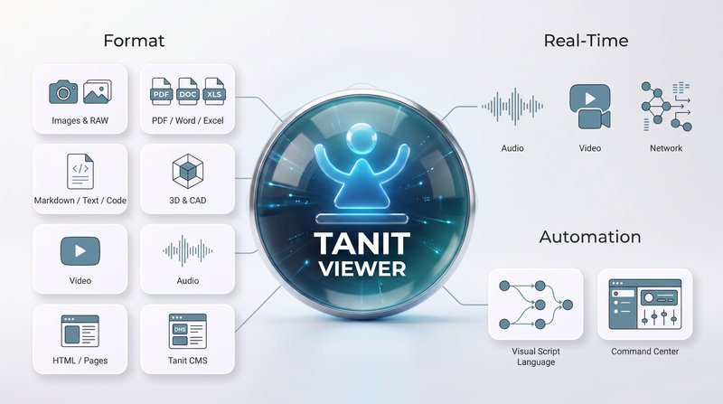
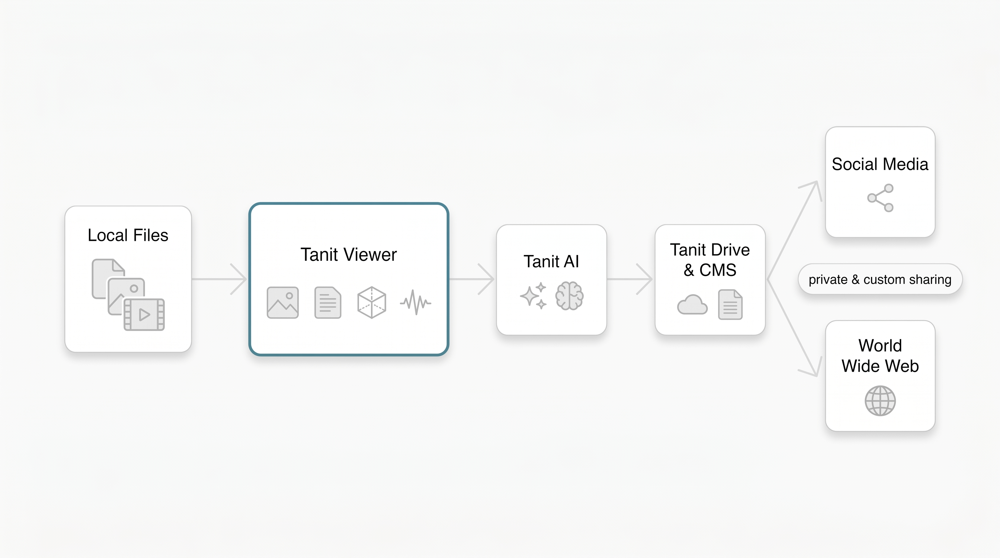
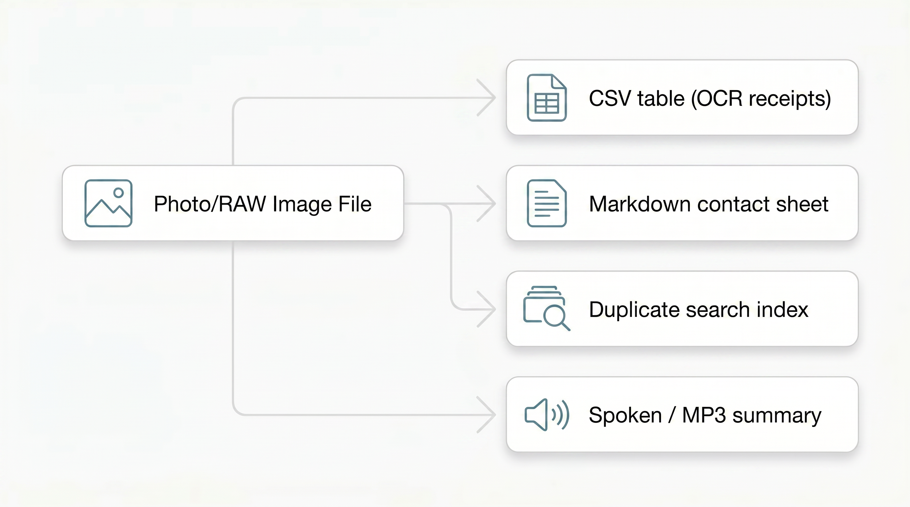
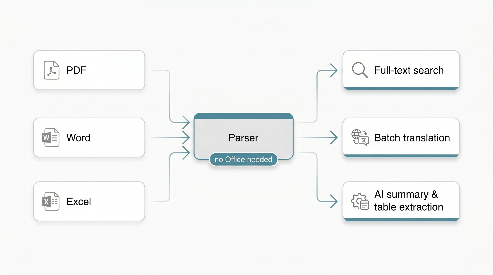
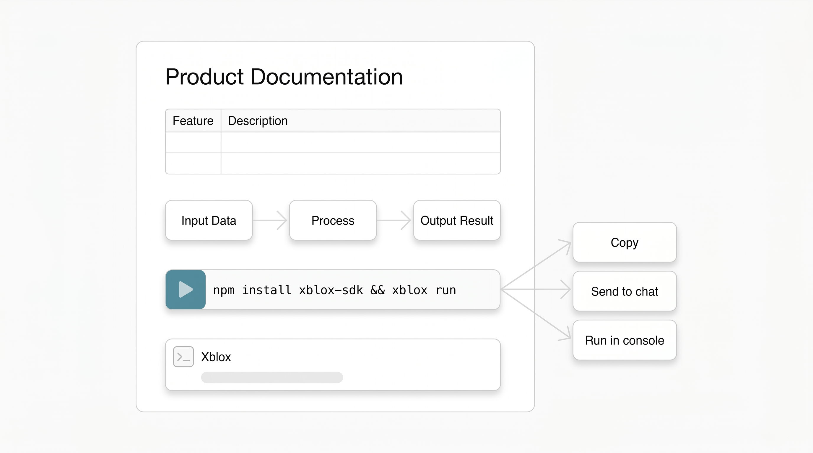
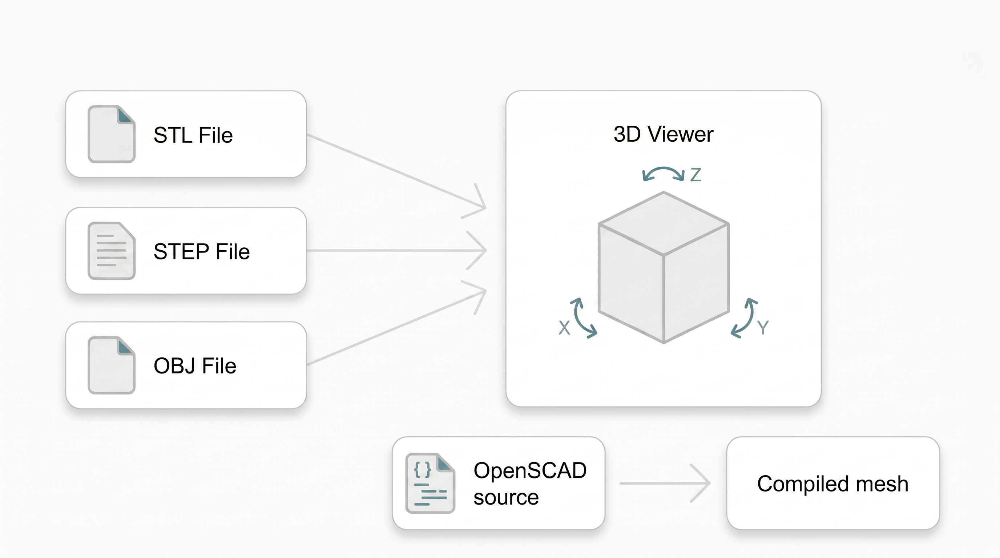
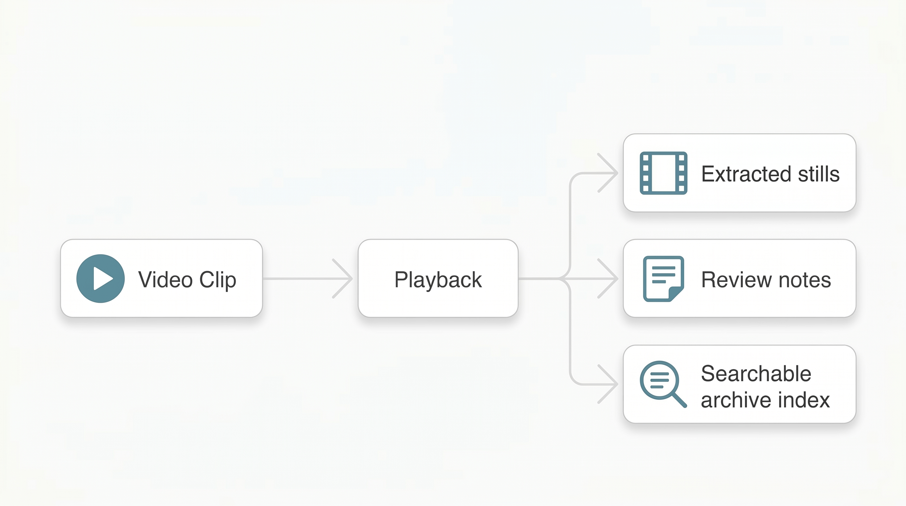
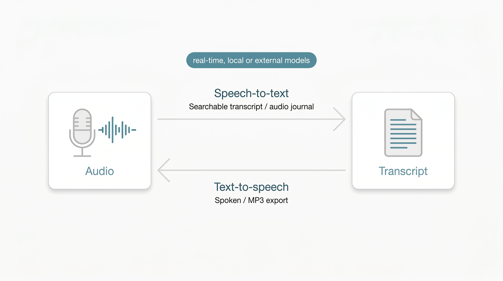
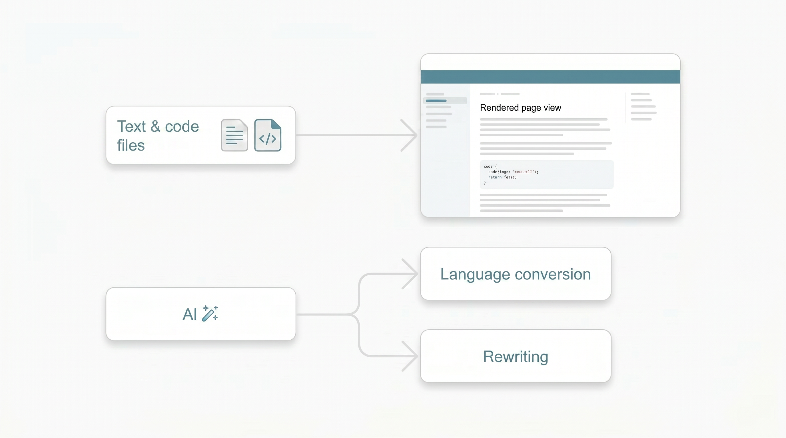
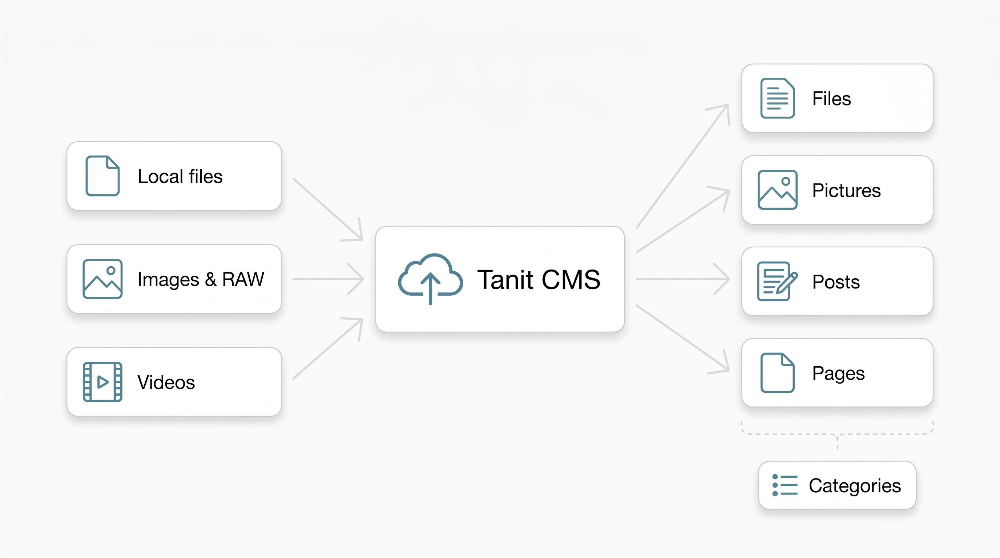

## Viewer

[See full documentation and tool description over here](https://tanit.polymech.info/user/cgo/pages/tanit-viewer-next)

Tanit is a multi-media talent, built to be used every day — no friction, no subscription pain. Major content types are supported natively, drawing on thirty years of working with all sorts of formats across development, science, gaming, and manufacturing.

Select a file, and the best available view opens in the centre panel. No "which app opens this?" moment — the image, the brief, the model, the clip, all in one place, right next to the chat and your work.

The viewer alone is already a keeper: it handles a remarkable range of formats, opens fast, and is rich in features. And because it sits right beside Tanit's AI and chat, working on your content — asking about it, transforming it, sharing it — becomes a genuine pleasure.

*One surface for images, documents, videos, 3D files, and interactive documentation.*

*Local files → Tanit Viewer → Tanit AI → Tanit Drive & CMS → Social Media / World Wide Web, with private and custom sharing.*

[test](https://tanit.polymech.info/user/3bb4cfbf-318b-44d3-a9d3-35680e738421/pages/tanit-viewer)

***

### Images

Images are first-class citizens here. Fast loading, smooth zooming, cropping, and effortless browsing through large photo sets — built for people who look at hundreds of pictures a day, not ten.

All the usual formats open directly (JPEG, PNG, WebP, TIFF, GIF, AVIF, HEIC and more), and so do camera RAW files from Sony, Canon, Nikon, Adobe DNG, and Olympus / OM System. Culling a shoot? Arrow keys and mouse buttons walk you through the folder without ever touching a menu.

### Documents

PDFs open instantly — still the common language of briefs, approvals, and invoices. Word and Excel files preview without Office installed at all, and spreadsheets get a clean grid view. Tanit parses document content directly, so full-text search covers Word, Excel, and PDF files — and the same parsed content is available to AI and scripted workflows.

### Markdown

Markdown opens as a readable page — tables, checklists, images, Mermaid diagrams, live Xblox blocks, and LaTeX math with chemistry notation — not a wall of asterisks. YAML frontmatter becomes a document header with an auto table of contents; callouts, citations, and footnotes suit lab notes, specs, and course material. Command blocks have real buttons: copy, send to chat, or run directly in the internal console.

### Xblox

Xblox files open as interactive blocks, and the same blocks work inside Markdown. A guide can carry a small working example instead of a screenshot of one. Documentation shouldn't only describe the thing — it should let you touch it.

### 3D & CAD

Models, prints, scans, and engineering handoff files open in a built-in 3D viewer. Rotate it, check it, approve it — without waiting for a specialist tool to boot.

The built-in model browser exposes available scene and assembly trees, with expandable parts and per-node visibility controls. Hierarchical formats retain their structure; flat mesh formats appear as a single model node.

Supported formats:

* **Meshes and scenes:** STL, OBJ, glTF / GLB, PLY, 3DS, 3MF, AMF, Collada (DAE), and FBX
* **CAD:** STEP / STP, IGES / IGS, BREP / BRP, and DXF
* **Universal and scientific 3D:** USD / USDA / USDC / USDZ, VRML / WRL, and VTK / VTP
* **Parametric source:** OpenSCAD (SCAD), compiled to an interactive mesh preview

STEP and IGES previews preserve available part and per-face colours, including appearances exported by CAD tools through STEP AP214 or AP242.

### Video

Clips, exports, and references play in place. MP4, MOV, WebM, MKV and the rest of the usual suspects.

### Audio

Speech works in both directions, in real time. Speech-to-text turns recordings — voice memos, interviews, audio journals — into text you can search, edit, and hand to AI. Text-to-speech reads content back to you or exports it as an audio file. Both run on local or external models, your choice.

### Text, HTML & Pages

Notes, logs, and scripts open instantly. HTML renders as a page, not source code — handy for generated reports and campaign previews. And Tanit 's own pages open ready to read or edit inline.

### Tanit CMS — sharing beyond the local machine

Everything in the viewer can go further than your local drive. Tanit has a built-in CMS, and you can push content directly from the workbench — no separate upload step, no browser tab.

Files, images, RAW photos, and videos upload as **files** or **pictures**, immediately available to the rest of the platform. Written content becomes a **post** or a **page**, organised into **categories** however you need. All the same viewer features — search, AI, Xblox workflows — apply to your CMS content too.

This means a photoshoot, a client document, a campaign page, or a processed export can go from local file to published content without switching context.

***

| Format                   | Direct Support (parsers)                  | Searchable        | Built-in Conversions                            | Potential Conversions (Xblox, AI/LLM)      |
| ------------------------ | ----------------------------------------- | ----------------- | ----------------------------------------------- | ------------------------------------------ |
| Images (JPEG, PNG, RAW…) | ✓                                         | metadata          | OCR → text / CSV                                | contact sheets, duplicate index, summaries |
| PDF                      | ✓                                         | full-text         | text extraction, translation                    | summaries, data extraction                 |
| Word / Excel             | ✓ (no Office needed)                      | full-text         | translation                                     | template filling, table extraction         |
| Spreadsheets / CSV       | ✓                                         | full-text         | —                                               | reports, data cleanup                      |
| Markdown / Text / Code   | ✓                                         | full-text         | —                                               | language conversion, rewriting             |
| Video                    | ✓ playback                                | —                 | —                                               | stills, review notes, archive index        |
| Audio                    | ✓ playback                                | via transcript    | STT ↔ TTS (real-time, local or external models) | transcripts, audio journals, summaries     |
| 3D & CAD                 | ✓                                         | —                 | OpenSCAD → mesh                                 | format conversion                          |
| HTML / Pages             | ✓                                         | full-text         | —                                               | export, summaries                          |
| Tanit CMS                | files, pictures, posts, pages, categories | ✓ (same as local) | direct upload from workbench                    | AI workflows, batch publish, Xblox pages   |

***

### From viewing to doing

Here is where it gets fun. Anything you can see, you can put to work — in batches, with AI, local models, Xblox blocks, or a simple script:

* **A folder of receipts** becomes a CSV, scanned and extracted automatically.
* **A shoot** becomes a Markdown contact sheet; a photo library gets indexed so duplicates finally surface.
* **A stack of Office and PDF documents** gets translated into another language straight from the toolbar — no opening files one by one.
* **Code and text** get converted from one language to another with batch AI blocks.
* **A video folder** turns into stills, review notes, or a searchable archive.
* And if reading isn't convenient right now: results can be **spoken out loud or saved as an MP3**.

Every viewer shares the same toolbar: switch view, open for editing, reveal in Explorer, or hand the file to chat.

***

## References

* [GitHub Flavored Markdown (GFM)](https://github.github.com/gfm/) — tables, task lists, strikethrough, autolinks, footnotes
* [CommonMark](https://commonmark.org/) — base Markdown syntax
* [YAML](https://yaml.org/) — document frontmatter (`---` header block)
* [KaTeX](https://katex.org/) — inline (`$…$`) and display (`$$…$$`) math; [supported TeX functions](https://katex.org/docs/supported.html)
* [mhchem](https://mhchem.github.io/MathJax-mhchem/) — chemistry notation (`\ce{…}`) via KaTeX extension
* [remark-directive](https://github.com/remarkjs/remark-directive) — fenced callouts (`:::note`, `:::theorem`, …)
* [Pandoc citation syntax](https://pandoc.org/MANUAL.html#citations) — inline references (`[@key]`, `[@key, p. N]`)
* [Mermaid](https://mermaid.js.org/) — flowcharts and diagrams in fenced blocks

