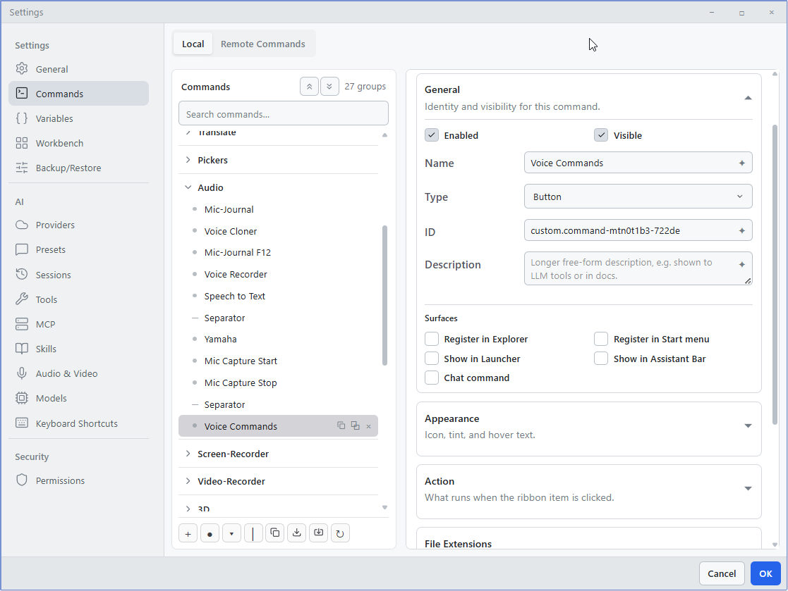
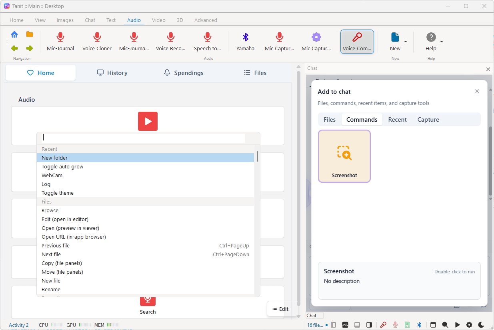
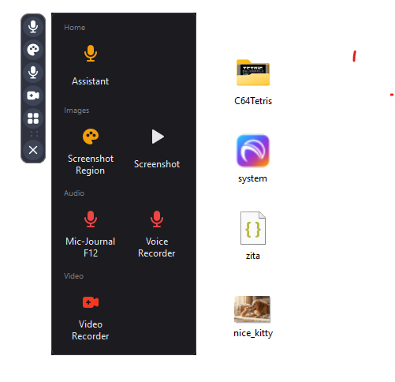
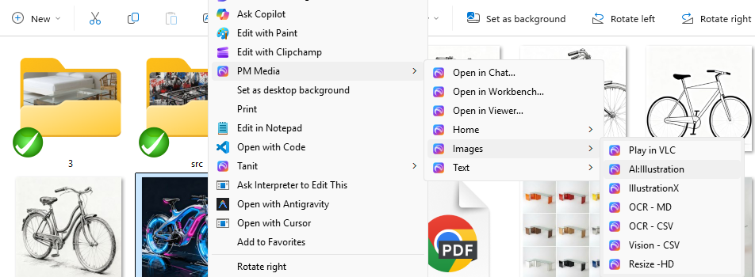
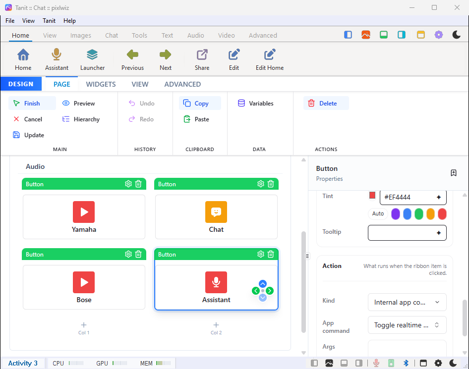
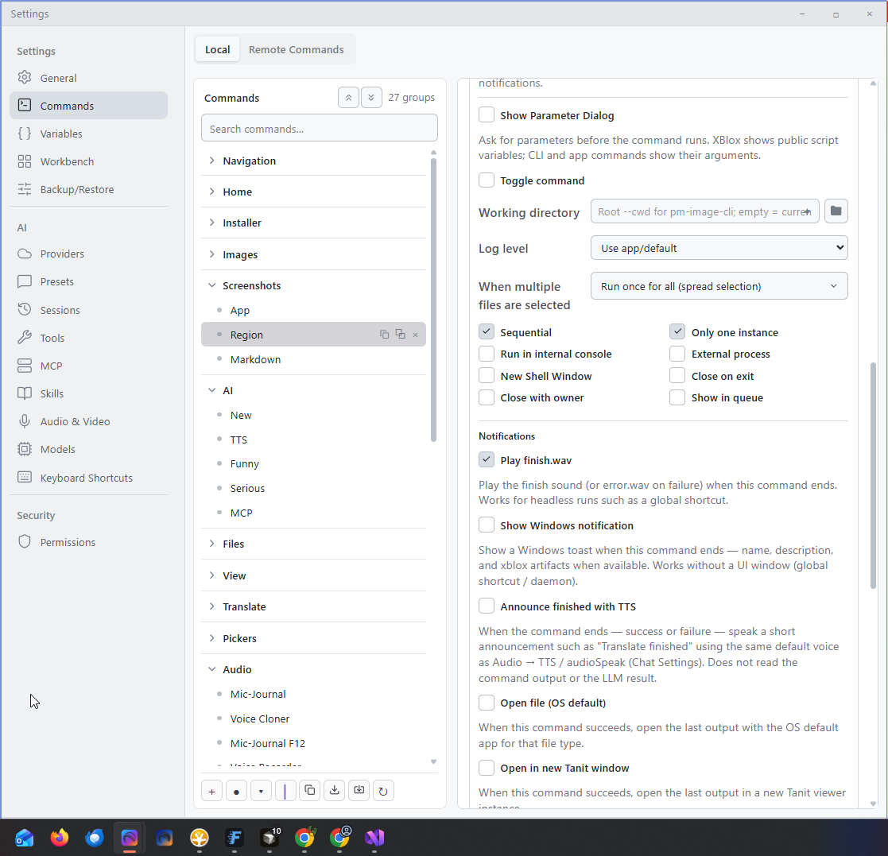
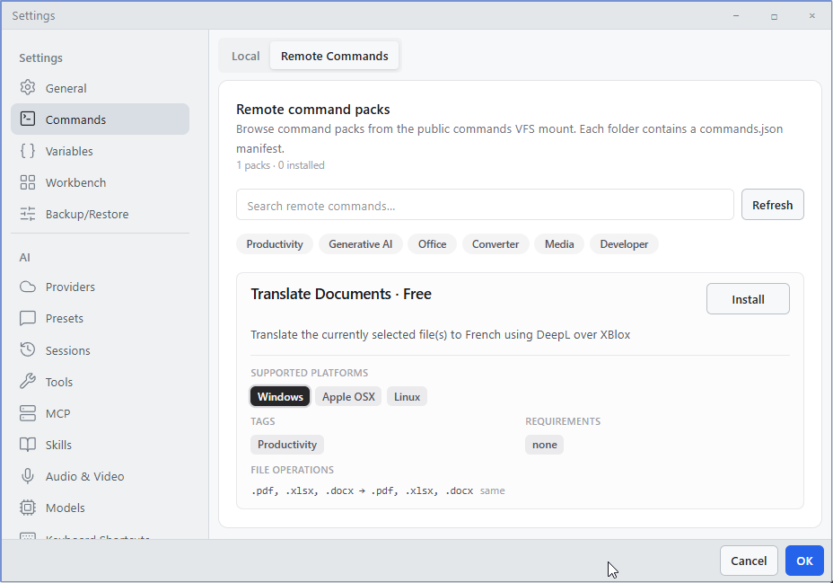
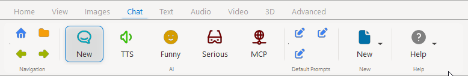
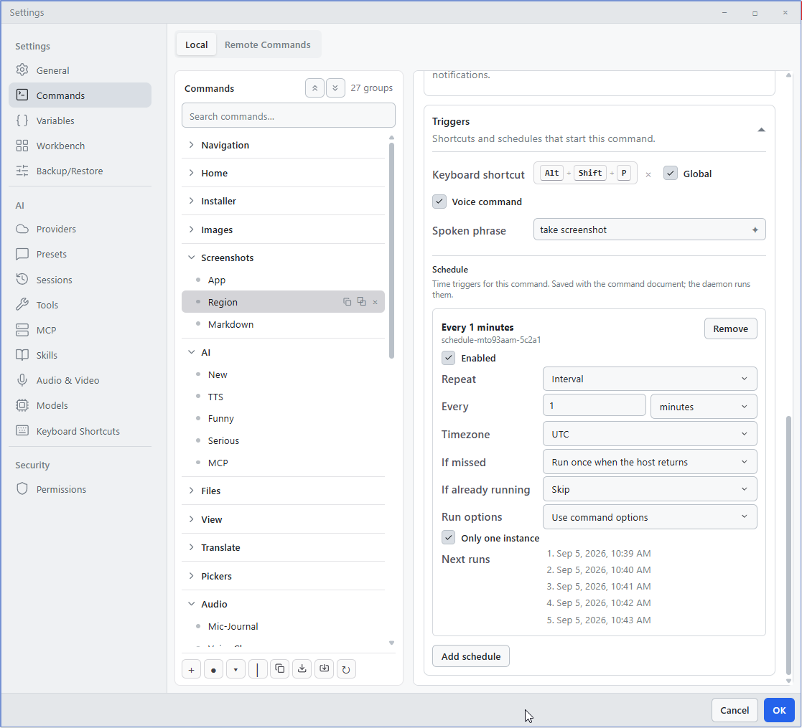
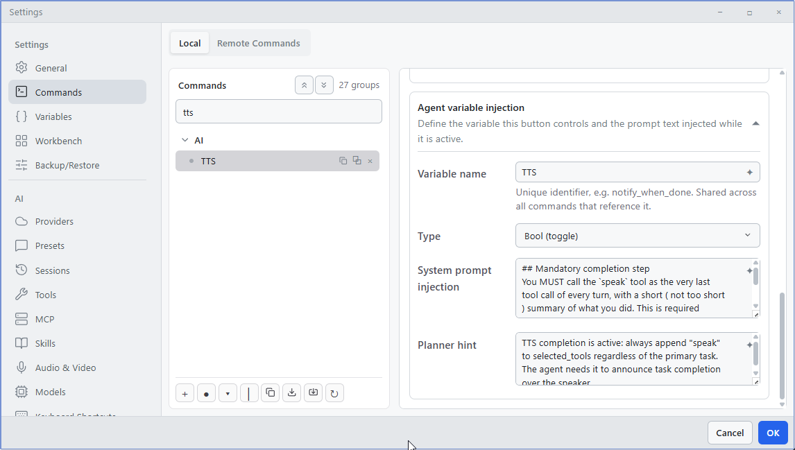

## Commands

Commands are reusable one-click actions. One button can extract audio from a video, translate selected files, open a folder, run an XBlox flow, or call any built-in Tanit tool. The same command can live on the ribbon, the assistant launcher, Windows Explorer, a keyboard shortcut, a spoken phrase, or a Page Builder button.

Configure them in **Settings → Commands**. The **Local** tab is your own library. The **Remote** tab installs shared packs.

This page is the end-user manual: a short setup path, then everyday examples, then advanced cases.

---

### Steps

**1. Open the editor**

Go to **Settings → Commands**. Pick a ribbon group (or add one) on the left. That group is the home for the new command.

{pm-profile="original"}

**2. Add a command**

Choose **Add command**. Give it a short **label** (this is what you see on the ribbon and in Explorer). Optionally add an icon, tint, tooltip, and a keyboard shortcut.

You can also ask in chat instead of filling the form:

> ```Create a command that extracts MP3 from MP4```

The assistant writes the entry into your command document. Edit it in Settings afterward — icon, shortcut, or **Run once per file**.

**3. Choose what it does**

Set the action kind:

| Type | Use when |
|:-----|:---------|
| **App** | Control the open Tanit window — panels, recording, layout. No extra process. |
| **CLI** | Run a built-in Tanit tool (resize, translate, agent, audio, video, …). See [CLI commands](./tanit-cli). |
| **XBlox script** | Run a `.xblox` flow. Context values can be edited in Settings before launch. See [XBlox](./xblox-docs). |
| **External** | Your own program, argument list, or shell one-liner (`ffmpeg`, scripts, …). |
| **URL / Path** | Open a link or folder in the system browser or file manager. |

A command is a **button**, a **dropdown** of sub-actions, or a **separator** in the group.

**4. Choose where it appears**

Leave it on the ribbon, then tick the extra surfaces you need (launcher, assistant bar, explorer, start menu, voice command or chat). Details and screenshots are under [Where commands appear](#where-commands-appear).

**5. Point it at files or a window (if it needs them)**

Most file commands use the current explorer selection. From the [launcher menu](#launcher-menu) they use the checked file chips instead.

- **Run once for all** (default) — one launch; every selected path is available together.
- **Run once per file** — one launch per file. Use this for batch translate, resize, or per-file exports.

You can also pin fixed files or folders when the command should not depend on the current selection. Window capture uses the launcher **Apps** chip (`${CURRENT_HWND}`).

**6. Run and refine**

Select a file, click the command, and check the result. If something fails, turn on **Run in internal console** so you can see the output. Then adjust arguments, variables, or run options.

---

### Examples

Everyday patterns from a typical Tanit setup.

**Extract audio** — **External** shell. Select a video, write an MP3 next to it, and register it in Explorer.

```json
{
  "id": "custom.command-53a3e21f-cc425",
  "label": "Extract Audio (MP3)",
  "type": "button",
  "externalCommand": {
    "mode": "shell",
    "shellLine": "ffmpeg -y -i \"${CURRENT_FILE}\" -vn -codec:a libmp3lame -q:a 2 \"${SRC_DIR}/${SRC_NAME}_audio.mp3\"",
    "cwd": "${CURRENT_PATH}"
  },
  "registerInExplorer": true,
  "runOptions": { "runInConsole": true },
  "source": { "kind": "selection" }
}
```

**Screenshot** — **App** command. Saves the main window. No selection needed.

```json
{
  "label": "Screenshot App",
  "type": "button",
  "appCommand": "takescreenshot"
}
```

**Video Recorder** — **XBlox** script with **toggle**. Start/stop capture from the assistant bar or launcher (`Ctrl+Alt+F8` in the default setup). To record the window selected in the launcher **Apps** row, pass `${CURRENT_HWND}` — see [Launcher context](#launcher-context).

```json
{
  "label": "Video Recorder",
  "type": "button",
  "cliCommand": "xblox",
  "args": ["run", "--src", "video-recorder-ex.xblox"],
  "toggle": true,
  "showInAssistantBar": true,
  "showInLauncher": true,
  "shortcut": "Ctrl+Alt+F8"
}
```

**Translate to Spanish** — **CLI** agent, **once per file**. Writes a translated copy beside the original; Explorer context menu for text files.

```json
{
  "label": "Translate to Spanish",
  "type": "button",
  "cliCommand": "llm",
  "args": [
    "agent", "--embed", "${CURRENT_FILE}",
    "--prompt", "Translate to Spanish",
    "--dst", "${SRC_DIR}/${SRC_NAME}_ex.${SRC_EXT}"
  ],
  "registerInExplorer": true,
  "source": { "kind": "selection", "selectionMode": "perItem" }
}
```

**Translate documents with XBlox** — one DeepL flow, exposed on the ribbon, assistant, launcher, and Explorer. Each selected document is its own run.

```json
{
  "label": "Translate document",
  "type": "button",
  "cliCommand": "xblox",
  "args": [
    "run",
    "--src", "${TANIT_SHARED}/xblox/network-deepl.xblox",
    "--CURRENT_FILE", "${CURRENT_FILE}",
    "--lang", "DE"
  ],
  "asLlmTool": true,
  "showInAssistantBar": true,
  "showInLauncher": true,
  "registerInExplorer": true,
  "explorerFileTypes": ["text"],
  "source": {
    "kind": "selection",
    "selectionMode": "perItem"
  }
}
```

**Heartbeat (interval)** — **External** shell, every 60 seconds. Pin a known folder; clock runs have no Explorer selection. Needs a scheduler host. See [Schedules](#schedules).

```json
{
  "label": "Heartbeat",
  "type": "button",
  "externalCommand": {
    "mode": "shell",
    "shellLine": "echo %DATE% %TIME%>>\"${KNOWNFOLDER:Temp}\\tanit-heartbeat.log\""
  },
  "runOptions": { "singleton": true },
  "triggers": {
    "schedules": [
      {
        "id": "schedule.heartbeat",
        "enabled": true,
        "kind": "interval",
        "intervalSeconds": 60,
        "timezone": "utc",
        "overlapPolicy": "skip"
      }
    ]
  }
}
```

**Nightly index (schedule)** — wrap `tanit-cli` as **External** so the clock host can launch it. Daily at 02:00 UTC. Start the daemon or `scheduler serve --execute`.

```json
{
  "label": "Nightly index",
  "type": "button",
  "externalCommand": {
    "mode": "argv",
    "command": "tanit-cli",
    "args": ["search", "index", "--src", "${KNOWNFOLDER:Pictures}"]
  },
  "runOptions": { "singleton": true, "showInQueue": true },
  "triggers": {
    "schedules": [
      {
        "id": "schedule.nightly-pictures",
        "enabled": true,
        "kind": "daily",
        "time": "02:00",
        "timezone": "utc",
        "overlapPolicy": "skip"
      }
    ]
  }
}
```

---

### Where commands appear

| Surface | Setting |
|:--------|:--------|
| Ribbon | Always part of a ribbon group (default home) |
| Assistant launcher menu | **Show in launcher** (hover or click Commands on the assistant toolbar, or **Alt+Win** while that toolbar is open) |
| Assistant toolbar | **Show in assistant bar** |
| Windows Explorer context menu | **Register in Explorer** (optionally images, video, audio, text, or folders) |
| Start menu | **Register in Start menu** |
| Keyboard shortcut | Optional shortcut on the command |
| Voice | Opt in under **Triggers**; say the wake phrase, then the command |
| Command line | New custom commands are listed from `tanit-cli --help` |

#### Ribbon

Commands live in tabs and show running state.

{pm-profile="original"}

#### Launcher toolbar

For daily use, pin frequent commands to the on-screen assistant toolbar (**Show in assistant bar**). Hover or click **Commands** to open the launcher menu (**Alt+Win** works while the toolbar is open).

{pm-profile="original"}

#### Launcher menu

The launcher menu (**Show in launcher**) is a grouped tile grid plus context chips. Open it by hovering or clicking **Commands** on the assistant toolbar, or press **Alt+Win** while that toolbar is open. Commands that use `${CURRENT_FILE}` / `${CURRENT_SELECTION}` or `${CURRENT_HWND}` pick up the chips you have checked — see [Launcher context](#launcher-context).

{pm-profile="original"}

#### Windows Explorer

Register a command to add it to the Explorer context menu.

{pm-profile="original"}

#### Page Builder

A Page Builder button can target any command.

{pm-profile="original"}


---

### Running commands

- **Selection** — most commands read the current explorer selection (or the checked file chips when you run from the [launcher menu](#launcher-menu)). Use **Run once per file** for batch jobs that write one output per input.
- **Current window** — from the launcher, the checked **Apps** chip fills `${CURRENT_HWND}` and `${CURRENT_SCREEN_SPEC}` (window capture / record).
- **Fixed source** — pin files or folders when the command should not depend on what is selected.
- **Toggle** — first click starts, second click stops. Useful for recording, streaming, or long-running jobs. A running launcher tile pulses; right-click it to stop.
- **Queue** — enable **Show in queue** to watch live status.

### Launcher context

The menu is more than a command palette: the chips under the tiles are the launch context.

**Open**

- Assistant toolbar → **Commands** (hover or click), or **Alt+Win** while that toolbar is open (the combo is swallowed so it does not open the Start menu). Hover stays open across the gap between the button and the menu; move away to dismiss. A click on **Commands** while hover is still opening the menu is ignored so it does not toggle shut. Click or **Alt+Win** still toggle once you have moved onto the menu.
- Empty if no enabled command has **Show in launcher**.

**File chips** (up to 8) — click to select one (like **Apps**); **Ctrl+click** adds or removes extra chips. Checked paths become `${CURRENT_FILE}` / `${CURRENT_SELECTION}` / `${SRC_*}` when you run a tile (click or **Enter** / **Space** on the hovered command). Dragging a file onto a tile still wins for that run.

If at least one **Recent** chip is checked, those recents fill `${CURRENT_FILE}` instead of the live Explorer selection. Mini Chat (`--src ${CURRENT_FILE}`) uses that path.

| Row | What you see |
|:----|:-------------|
| **Selection** / **Files** | Live Explorer or Desktop selection (starts checked), plus a short trail of earlier picks (unchecked). |
| **Recent** | Files from this Tanit session that still exist on disk, then a few Windows jumplist / Recent items to fill leftover slots. Missing files and dangling `.lnk` targets are skipped (Windows would otherwise prompt). Local documents take priority. Browser tabs are capped (at most two, one per site) so Chrome history does not flood the row. |

Double-click a file chip to open it. Double-click an **Apps** chip to restore that window (if it is minimized) and bring it to the front. Drag files from Explorer onto a tile that still contains `${CURRENT_FILE}` or `${CURRENT_SELECTION}` — that drop is the selection for that one run.

**Apps chips** (up to 8) — taskbar windows, excluding Tanit itself. One at a time. The window you were in before opening the launcher starts selected (**last app**). Click another to retarget. A command click then binds:

`${CURRENT_HWND}`, `${CURRENT_PID}`, `${CURRENT_WINTITLE}`, `${CURRENT_PROCESS}`, `${CURRENT_SCREEN_SPEC}`

Use `${CURRENT_SCREEN_SPEC}` as an XBlox / CLI screen input (`screen:0:hwnd=…`). Pass `--CURRENT_HWND` the same way as `--CURRENT_FILE` when you bind from extra args.

**Keyboard** (hover is focus; the first command is hovered on open)

| Key | Action |
|:----|:-------|
| Arrows, **Home** / **End** | Move among tiles or chips |
| **Tab** / **Shift+Tab** | Commands → files → apps (and back) |
| **Enter** / **Space** | Run the hovered command, or select the hovered chip (exclusive; **Ctrl+Enter** on a Recent chip opens the file) |
| Letters | Type-ahead: prefix match on labels (1 s buffer). Repeat the same letter to cycle matches |
| **Backspace** | Edit the type-ahead buffer |
| **Esc** | Clear type-ahead first, then close |

**Extract audio** and **Translate document** in [Examples](#examples) already use file tokens. Window capture from the launcher:

```json
{
  "label": "Record this window",
  "type": "button",
  "cliCommand": "xblox",
  "args": [
    "run",
    "--src", "${TANIT_SHARED}/xblox/video-recorder-ex.xblox",
    "--CURRENT_HWND", "${CURRENT_HWND}"
  ],
  "toggle": true,
  "showInLauncher": true
}
```

---

## Advanced

For power users, libraries, schedules, and automation.

### Run options

**Settings → Commands → Run Options.** App commands still get the parameter dialog, toggle, and notifications. CLI, XBlox, and External also get working directory, selection, and process flags.

{pm-profile="original"}

| Option | Effect |
|:-------|:-------|
| **Show Parameter Dialog** | Ask for parameters before the command runs. XBlox shows public script variables; CLI and app commands show their arguments. |
| **Toggle command** | First click starts, second click stops. Useful for recording, streaming, or long-running jobs. |
| **Working directory** | CLI and XBlox. Root `--cwd` for `pm-image-cli`; empty uses the current / default directory. |
| **Log level** | CLI and XBlox. **Use app/default**, or Trace through Off. |
| **When multiple files are selected** | **Run once for all (spread selection)** (default) or **Run once per file**. See [Running commands](#running-commands). |

Process flags (CLI, XBlox, External):

| Option | Effect |
|:-------|:-------|
| **Sequential** | On by default. A second click waits until the current run of this command finishes. Uncheck to allow concurrent runs. |
| **Only one instance** | Blocks a second overlapping run of the same command (across Tanit processes that share the profile). |
| **Run in internal console** | Output appears in Tanit's built-in terminal. |
| **External process** | XBlox only. Spawn a separate process instead of running the script in the UI host. |
| **New Shell Window** | Opens a visible external terminal. |
| **Close on exit** | Closes the console tab or shell window when the process finishes. |
| **Close with owner** | Stops the command when the surface that launched it closes. |
| **Show in queue** | On by default. Adds a row to the queue panel. |

If none of **Run in internal console**, **New Shell Window**, or **External process** are set, an XBlox script stays in the UI host (same as a ribbon click with no extra process).

**Notifications** (every command kind, including headless runs such as a global shortcut):

| Option | Effect |
|:-------|:-------|
| **Play finish.wav** | Play the finish sound (or `error.wav` on failure) when the command ends. |
| **Show Windows notification** | Windows toast with the command name, description, and XBlox artifacts when available. Works without a UI window (global shortcut / daemon). |
| **Announce finished with TTS** | Speak a short line such as "Translate finished" using the default voice from Chat Settings → Audio → TTS. Does not read the command output or the LLM result. |
| **Open file (OS default)** | On success, open the last output with the OS default app for that file type. |
| **Open in new Tanit window** | On success, open the last output in a new Tanit viewer instance. |

### Command libraries

The **Remote** tab lists curated packs. Installing a pack merges its groups into your local ribbon. You can then edit, reorder, or disable individual commands.

{pm-profile="original"}

Remote metadata (author, support link, pricing) is read-only. After install, review placement and test on a small selection.

### Export and import

In **Settings → Commands**, select a command, a group, or several items:

- **Export** — copy JSON to the clipboard or download it.
- **Import** — paste JSON to merge into the current document.

Exports include labels, icons, actions, visibility, run options, schedules, and variables. Import merges by command id — existing ids are updated; new ids are appended to the target group.

### Command variables

Use `${NAME}` placeholders in arguments, paths, URLs, and shell lines. They expand at launch from the current selection (Explorer, launcher file chips, or a drop), the launcher Apps chip, last voice utterance, clock, folders, environment, and saved user variables. Unresolved tokens stay as `${NAME}` so later steps can still see them.

The variable picker in Settings lists the same names.

#### Current file / selection

From the file tree, Explorer, a launcher **Selection** / **Files** / **Recent** chip, or a drop onto a launcher tile.

| Variable | Resolves to |
|:---------|:------------|
| `${CURRENT_FILE}` | Selected file path (checked Recent chips if any, else first checked chip / focused item) |
| `${CURRENT_FILE_NAME}` | Selected file name with extension |
| `${CURRENT_PATH}` | Current folder, or parent folder when a file is selected |
| `${CURRENT_SELECTION}` | All selected paths (whitespace-separated). In an `args` array a bare `${CURRENT_SELECTION}` becomes one argument per path |
| `${SRC_FILE}` | Source file path (per-item mode) |
| `${SRC_DIR}` | Source parent folder |
| `${SRC_NAME}` | Source name without extension |
| `${SRC_EXT}` | Source extension without the leading dot |
| `${SRC_FILE_EXT}` | Source extension with the leading dot |
| `${SRC_REL}` | Source path relative to a bundle root when a relative base is set |

#### Current window

From the launcher **Apps** chip (the taskbar window you target). Empty until an app chip is checked, so tokens stay as `${CURRENT_HWND}` until then. Pass `--CURRENT_HWND value` the same way as `--CURRENT_FILE` from CLI or XBlox extra args.

| Variable | Resolves to |
|:---------|:------------|
| `${CURRENT_HWND}` | Decimal window handle of the selected taskbar app |
| `${CURRENT_PID}` | Process id of that window |
| `${CURRENT_WINTITLE}` | Window title |
| `${CURRENT_PROCESS}` | Process image name (`soffice.bin`, `chrome.exe`, …) |
| `${CURRENT_SCREEN_SPEC}` | XBlox / CLI capture spec `screen:0:hwnd=<CURRENT_HWND>` |

#### Voice

Filled from the last matched utterance in this process (UI listen, CLI `voice listen` / `voice replay`, or an XBlox `voiceListen` block). Empty until something is heard, so unresolved tokens stay as `${VOICE_COMMAND}`. Spawned commands also inherit `PM_VOICE_WAKE` / `PM_VOICE_COMMAND` / `PM_VOICE_FULL`. Pass `--VOICE_COMMAND value` the same way as `--CURRENT_FILE` to bind them from CLI or XBlox extra args.

| Variable | Resolves to |
|:---------|:------------|
| `${VOICE_WAKE}` | Wake phrase that matched (`Tanit`, or empty when none) |
| `${VOICE_COMMAND}` | Spoken text after the wake phrase |
| `${VOICE_FULL}` | Full transcript, including the wake phrase |

#### Process

| Variable | Resolves to |
|:---------|:------------|
| `${CWD}` | Working directory for this run |
| `${PATH_SEP}` | Platform path separator |
| `${PATH_LIST_SEP}` | Platform list delimiter |

#### Date / time

| Variable | Resolves to |
|:---------|:------------|
| `${YYYY}` | Four-digit year |
| `${MM}` | Month |
| `${DD}` | Day of month |
| `${HH}` | Hour (24 h) |
| `${mm}` | Minutes |
| `${SS}` | Seconds |

#### Known folders

| Variable | Resolves to |
|:---------|:------------|
| `${KNOWNFOLDER:Home}` | User home / profile |
| `${KNOWNFOLDER:Config}` | Configuration folder |
| `${KNOWNFOLDER:Data}` | User data folder |
| `${KNOWNFOLDER:Cache}` | Cache folder |
| `${KNOWNFOLDER:Temp}` | Temporary files |
| `${KNOWNFOLDER:Desktop}` | Desktop |
| `${KNOWNFOLDER:Documents}` | Documents |
| `${KNOWNFOLDER:Downloads}` | Downloads |
| `${KNOWNFOLDER:Pictures}` | Pictures |
| `${KNOWNFOLDER:Local_App_Data}` | Local app data |
| `${KNOWNFOLDER:Roaming_App_Data}` | Roaming app data |
| `${KNOWNFOLDER:Program_Data}` | Shared program data |
| `${KNOWNFOLDER:Public}` | Public profile |
| `${KNOWNFOLDER:Public_Documents}` | Public Documents |
| `${KNOWNFOLDER:Windows}` | Windows folder |
| `${KNOWNFOLDER:Program_Files}` | Program Files |

#### App paths

| Variable | Resolves to |
|:---------|:------------|
| `${TANIT_ROOT}` / `${tanit}` | Directory containing the Tanit executable |
| `${TANIT_SHARED}` | Shipped shared assets (`dist/shared` in the install layout) — XBlox samples, etc. |
| `${APP_EXE}` | Full path to the running executable |
| `${APP_DATA}` | Roaming application data |
| `${APP_LOCAL_DATA}` | Local (non-roaming) application data |
| `${CONFIG_DIR}` | Profile / settings root |
| `${TEMP_DIR}` | App-scoped temp folder |

#### Other

| Variable | Resolves to |
|:---------|:------------|
| `${ENV:NAME}` | Any environment variable (replace `NAME`) |
| `${USER:MY_VARIABLE}` | A variable saved in Settings (replace `MY_VARIABLE`) |
| `${PATH_DIR:VAR}` | Parent directory of another variable (`${PATH_DIR:CURRENT_FILE}`) |
| `${PATH_NAME:VAR}` | Filename stem of another variable |
| `${PATH_EXT:VAR}` | Extension (with leading dot) of another variable |
| `${PATH_BASE:VAR}` | Filename with extension of another variable |
| `${PATH_ABS:VAR}` | Absolute path of another variable |

Agent variables from **Set variable** commands also appear in the picker. Use them to control tone or to enable behaviour such as speaking a final summary.

{pm-profile="original"}

## Triggers

{pm-profile="original"}

### Keyboard Shortcuts

Commands can triggered for application open but also globally in background (see `tanit-cli daemon`)

### Voice Commands

Speak a command instead of clicking it. This is the always-listening **command center** — not the realtime voice conversation in chat. You say a wake phrase (default **Tanit**), then a command name. Tanit matches that phrase and runs the command the same way a ribbon button or shortcut would.

#### Start listening

**1. Turn it on** in **Settings → Audio & Video → Voice commands**. Leave **Enable voice commands** checked.

**2. Start the listener** while Tanit is open. The default library includes a **Voice Commands** toggle (`togglevoicecommand`). You can also bind **Start voice commands** / **Stop voice commands** on the ribbon or launcher. See [App commands](#app-commands).

Saving Audio & Video reloads a listener that is already running.

The listener stays idle until you finish a short utterance, then it transcribes that clip only.

This is not **Toggle realtime voice** (`togglerealtime`). Realtime voice is a live chat session. Voice commands listen for a phrase, run one action, and go back to idle.

#### What you can say

After the wake phrase:

| You say | What runs |
|:--------|:----------|
| `Tanit screenshot` | Take screenshot (`screen shot` also works) |
| `Tanit explorer` | Toggle the file tree (`explore` is close enough) |
| `Tanit search cats` | Open native search with **cats** already in the query |
| `Tanit stop` / `Tanit cancel` | Cancel the command that is running |
| `Tanit stop listening` | Stop the voice listener |

Leave the wake phrase **empty** in settings if you want no prefix — then `screenshot` alone is enough. That is easier to trigger by accident.

Built-in **App** verbs (screenshot, panels, search, …) are available without extra setup. Their labels and aliases count as spoken phrases.

Your own commands are **opt-in**. Open the command in **Settings → Commands**, expand **Triggers**, and tick **Voice command**.

- Leave **Spoken phrases** empty to use the command label (and id).
- Or list aliases, split on comma, semicolon, `|`, or a new line — not on space, so `screen shot` stays one phrase.

```json
{
  "label": "Extract Audio (MP3)",
  "type": "button",
  "asVoiceCommand": true,
  "voiceCommand": "extract audio, extract mp3",
  "externalCommand": {
    "mode": "shell",
    "shellLine": "ffmpeg -y -i \"${CURRENT_FILE}\" -vn -codec:a libmp3lame -q:a 2 \"${SRC_DIR}/${SRC_NAME}_audio.mp3\"",
    "cwd": "${CURRENT_PATH}"
  }
}
```

Matching is a little tolerant: dropped letters (`explore` → `explorer`) and common splits (`queen shot` → `screenshot`) still hit. Extra words after a leftover slot such as `search ${query}` are passed through as that slot (`search cats` → query `cats`). `${query}` belongs in the spoken phrase, not in the search box.

A voice trigger has no Explorer click — pin a **fixed source** if the command needs files, or use a known folder. Same caveat as [schedules](#schedules). Spoken text is available as `${VOICE_WAKE}`, `${VOICE_COMMAND}`, and `${VOICE_FULL}` (see [Command variables](#command-variables)). Slot leftovers such as `search ${query}` still bind `${query}` separately.

#### Voice Command Settings

All of these live under **Settings → Audio & Video → Voice commands**. Chat STT / TTS models stay on **Settings → Chat**; devices and the command center are on Audio & Video.

| Setting | What it does |
|:--------|:-------------|
| **Enable voice commands** | Master switch. Uncheck to stop a running listener on save. |
| **Wake phrase** | Prefix before the command. Default `Tanit`. Empty = no prefix. |
| **Voice command microphone** | Dedicated listen mic. Empty uses the Audio & Video input, then the system default. **Input source** and **gains** above this section still apply. |
| **STT provider** / **STT model** | How speech becomes text. Empty uses the Chat speech-to-text setting. Local Whisper is the usual offline choice; Tanit / Pixlwiz and ElevenLabs need credentials. |
| **Backend** | Local Whisper only. **GPU (CPU fallback)** is the default; if the GPU cannot load the model, that listen session uses CPU. **CPU** forces CPU. |
| **Route** | **Trigger mapped commands** (default) runs the match. **Hand off to realtime agent** starts a live voice chat with the recognized text, then listening resumes when that session ends. |
| **Speech filter** | Clean the clip after you stop talking. **Auto** uses DeepFilter when it is available. **Off** skips enhancement. **GTCRN** is 16 kHz speech enhancement. |
| **Filter model** | Optional DeepFilter / GTCRN model path. Empty uses the built-in default. |
| **Aggressive post-filter** | Stronger DeepFilter on very noisy rooms. Ignored when the filter is off or GTCRN. |
| **Filter blend** | How much of the filter to keep. `1` (default) is full enhancement. `0` is the original clip. Works for DeepFilter and GTCRN. |
| **Language** | Whisper language (`auto`, `en`, `de`, …). |

Microphone, desktop loopback, mix, and camera stay in the Audio & Video block **above** Voice commands. Pick **Input source** there (microphone, desktop audio, or mix) if you want the command center to hear the room vs. system playback.

#### CLI

`tanit-cli voice listen` is the same loop without the UI. `tanit-cli voice replay --text "Tanit screenshot"` checks matching with no microphone. `voice stop` stops an active listen process. Omit `--wake-phrase` for no prefix. `--backend gpu` is the default and falls back to CPU, same as settings. `--filter-blend` is `1` (full filter) unless you pass a mix.

### Schedules

A command can run on a clock as well as from a click. Open the command in **Settings → Commands** and expand **Schedule** (shown when the scheduler feature is on).

Each command may have several independent schedules. Every schedule has a stable id — do not recycle ids if you delete and recreate a job.

| Kind | What you set |
|:-----|:-------------|
| **Once** | A single date and time |
| **Interval** | Every *n* seconds, minutes, or hours (1 second and up) |
| **Daily** | Wall-clock time |
| **Weekly** | Weekdays plus time |
| **Monthly** | Day of month plus time (31 clamps to the last day of short months) |
| **Cron** | Stored for later; the native host does not execute cron yet |

Also set:

- **Timezone** — UTC, local time, or an IANA zone.
- **If missed** — skip, or run once when the host returns.
- **If already running** — skip, keep one waiting, or replace the current run.
- **Only one instance** — recommended for unattended jobs.
- **Run options** — use the command defaults, or override the complete run-options set for that schedule.

The card shows a short summary and the next few planned runs. Saving the command document notifies a running daemon. If the daemon is offline, the definition is still saved and starts when the daemon runs.

A **host** ticks the clock. While Tanit is open, the UI process is the preferred host (it takes leadership over a tray daemon). Clock dispatch launches **External**, **CLI**, and **XBlox** commands (`tanit-cli <verb> …`, with `${TANIT_SHARED}` and other variables expanded). **App** and ribbon verbs on a schedule still need a live UI window; without one they are skipped.

Commands that use `${CURRENT_FILE}` or `${CURRENT_SELECTION}` have no Explorer selection when they fire from the clock — pin a fixed source, or use a known folder.

#### Run a schedule

**1. Save the command** with at least one enabled schedule (Settings or the JSON examples above).

**2. Start a host** — pick one:

| Host | Use when |
|:-----|:---------|
| Tanit window | App is open. Bind ribbon buttons to `schedulerstart` / `schedulerstop` / `schedulerpause` (see [App commands](#app-commands)). |
| `tanit-cli daemon register` | Always-on when the UI is closed. Writes a login entry and starts the tray daemon. |
| `tanit-cli scheduler serve --execute` | Foreground. Prints found schedules and each due run. Ctrl+C stops. |

Without `--execute`, `serve` and `tick` only persist due times. They do not launch the command.

**3. Confirm** — serve logs `startup: found N scheduled command(s)` and later `due … start pid=…`. Or:

```bash
tanit-cli scheduler status
tanit-cli scheduler next
```

**4. Fire once** without waiting for the clock:

```bash
tanit-cli scheduler run-now --schedule schedule.heartbeat --execute
```

#### CLI examples

```bash
# Always-on (login tray)
tanit-cli daemon register
tanit-cli daemon stop

# Foreground host — logs found schedules; Ctrl+C exits
tanit-cli scheduler serve --execute

# Preview the next planned run (does not persist, does not launch)
tanit-cli scheduler next
tanit-cli scheduler next --count 5

# Advance due times; add --execute to launch External commands
tanit-cli scheduler tick
tanit-cli scheduler tick --execute

# Run one schedule immediately
tanit-cli scheduler run-now --schedule schedule.nightly-pictures --execute

# Pause / resume the whole host
tanit-cli scheduler pause
tanit-cli scheduler resume
tanit-cli scheduler status
```

Isolate a trial from your real profile. Use both flags; do not point `--config-dir` at the live Tanit folder unless you intend to.

```bash
tanit-cli --config-dir D:\tmp\sched --commands D:\tmp\sched\commands.json scheduler serve --execute
tanit-cli --config-dir D:\tmp\sched --commands D:\tmp\sched\commands.json scheduler next --now 2026-08-22T12:00:00Z
```

`--now`, `--namespace`, `--count`, and `--schedule` go on the subcommand (`scheduler next --now …`), not before `scheduler`.

### Turn any XBlox flow into a command

Every `.xblox` script can become a first-class command. Define it once, place it in a ribbon group, and choose the other surfaces:

- **Ribbon** — the command's normal home.
- **Assistant toolbar or launcher** — enable `showInAssistantBar` or `showInLauncher`.
- **Assistant tool** — enable `asLlmTool` so the assistant can invoke it.
- **MCP tool** — expose the command through Tanit's MCP server.
- **Built-in pages** — bind it to a Page Builder button.
- **Windows Explorer** — enable `registerInExplorer`; optionally restrict to images, video, audio, text, or folders.

XBlox commands are selection-aware. In aggregate mode a flow receives the whole selection; in per-item mode Tanit launches it once per file and binds `${CURRENT_FILE}`, `${SRC_DIR}`, `${SRC_NAME}`, and the other source variables. The same flow works from the file tree, the ribbon, an Explorer selection, or the [launcher file chips](#launcher-context).

They are window-aware as well. From the launcher **Apps** chip, `${CURRENT_HWND}` and `${CURRENT_SCREEN_SPEC}` feed capture/record blocks (`screen:0:hwnd=…`) without copying a handle by hand.

They are URL-aware as well. A script can declare a context value such as `url`, and the command can pass a literal URL or `${USER:SERVICE_URL}` through `--url`. HTTP blocks then consume that value without hard-coding an endpoint.

The script remains the source of the workflow; the command only supplies placement, selection policy, run options, and context values. Edit the `.xblox` file once and every surface uses the updated version.

### Selection modes in production

| Mode | Use when |
|:-----|:---------|
| **Run once for all** | One job should see the whole selection — compare, merge, or batch-upload. |
| **Run once per file** | Each file needs its own output path — translate, resize, OCR, rename. |

Per-file runs appear as separate queue rows when **Show in queue** is enabled.

### Toggle and long-running commands

Toggle commands share one id across start and stop. The ribbon, launcher, and shortcut surfaces show active state while the job runs.

For background services (microphone capture, watch folders, streaming helpers), prefer **Close with owner** when the command should stop with the surface that started it.

### Agent and assistant integration

Commands marked for LLM use can be invoked by the assistant as tools. Keep labels and descriptions clear — they become part of the tool catalog the model sees.

Variable placeholders in arguments are resolved at execution time, not when the assistant creates the command definition.

### App commands

App commands are built-in verbs that talk to the **live Tanit window**. They do not spawn a child process — the action runs on the UI thread (toggle a panel, start recording, reveal a file, switch workbench, resize the frame).

In Settings, set the action kind to **App** and pick a verb from the list. In JSON, set `"appCommand"` to the verb id:

```json
{
  "id": "custom.command-mpx9r1ur-8c6df",
  "label": "Assistant",
  "type": "button",
  "appCommand": "togglerealtime",
  "toggle": true,
  "showInLauncher": true
}
```

Ids are case-insensitive; underscores, dashes, and spaces are ignored (`Toggle-File_Tree` → `togglefiletree`). Many verbs also accept short aliases (listed below where useful).

#### Passing arguments

Optional payloads come from:

| Source | Example |
|:-------|:--------|
| Pipe form (IPC / hotkeys) | `setframesize\|800x600`, `switchworkbench\|chat`, `open\|C:\\shot.png` |
| `args` array in the custom command | `"args": ["800x600"]` or `"args": ["main"]` |
| `userData` fields | `path`, `url`, `size`, `width`/`height`, `options` (search) |

When paths are omitted, file-oriented verbs often fall back to the current explorer selection or the open viewer.

**Panel visibility:** every dock/overlay that has a `toggle…` verb also has idempotent `show…` / `hide…` variants (no-op if already in that state). Prefer show/hide in scripts and remote packs so layout does not flip unexpectedly.

Availability of some verbs depends on the build (chat, console, queue, ribbon, browser, session video, realtime). Unavailable verbs stay listed but are disabled in Settings.

#### General

| Verb | Aliases (selected) | What it does | Args / notes |
|:-----|:-------------------|:-------------|:-------------|
| `takescreenshot` | `screenshot` | Save a PNG of the main window | — (default shortcut `Alt+P`) |
| `pausebatch` | `pause` | Pause the active batch job | — |
| `resumebatch` | `resume` | Resume the active batch job | — |
| `cancelbatch` | `cancel` | Cancel the active batch job | — |
| `chat` | — | Open / focus chat | Optional file paths to attach |
| `browse` | `reveal`, `syncfiletree` | Reveal path(s) in the file tree | Paths; selection when empty |
| `edit` | `editfile`, `openeditor`, `editor` | Open centre Monaco editor | Optional path(s); current viewer when empty |
| `open` | `openfile`, `previewfile`, `viewfile` | Open path(s) in the centre file viewer | Paths / `${…}` |
| `openurl` | `urlopen`, `browseurl` | Open HTTP(S) in the in-app browser | URL; relative CMS paths supported |
| `showhome` | `home`, `openhome` | Show the home dashboard | — |
| `recordstart` | `startrecord` | Start session (input) recording | — (`Ctrl+R`) |
| `recordstop` | `stoprecord` | Stop session recording and write snapshot | — (`Ctrl+H`) |
| `videorecordstart` | `videostart` | Start session video (MP4) | — (`Ctrl+Alt+R`) |
| `videorecordstop` | `videostop` | Stop session video | — (`Ctrl+Alt+H`) |
| `videorecordpause` | `videopause` | Pause / resume session video | — (`Ctrl+Alt+P`) |
| `replay` | `sessionreplay` | Apply a saved session layout | Path to session JSON |
| `realtimestart` | `startrealtime`, `voicestart` | Start realtime voice session | — |
| `realtimestop` | `stoprealtime`, `voicestop` | Stop realtime voice | — |
| `togglerealtime` | `realtimetoggle` | Toggle in-panel live voice | Opens chat if needed |
| `activaterealtime` | `pttrealtime` | Start/focus live voice (does not stop) | — |
| `togglelauncher` | `assistantbar`, `launcherbar` | Toggle detached assistant toolbar | — |
| `togglevideorecord` | `togglevideo` | Toggle detached video record | — |
| `togglemicrecord` | `togglemic` | Toggle mic + live transcript | — |
| `previousfile` | `prevfile` | Previous file in viewer history / list | — |
| `nextfile` | `filenext` | Next file in viewer history / list | — |

#### Scheduler

These verbs control the **command scheduler** (clock + hotkey triggers on custom commands). They are not the chat LLM scheduler. They persist `paused` in `run-ipc/scheduler/state.json` and, when the window is open, keep the UI host as leader.

Do not confuse them with `pausebatch` / `resumebatch` (`pause` / `resume` aliases) — those pause a batch job.

| Verb | Aliases | What it does |
|:-----|:--------|:-------------|
| `schedulerstart` | `startscheduler`, `resumescheduler` | Clear paused, take leadership, and fire any due schedule (or run-now if none is due) |
| `schedulerstop` | `stopscheduler` | Persist paused — due times stay, nothing launches until start |
| `schedulerpause` | `pausescheduler` | Toggle paused |

```json
{
  "label": "Start scheduler",
  "type": "button",
  "appCommand": "schedulerstart"
}
```

With the UI closed, use `tanit-cli daemon register` or `tanit-cli scheduler serve --execute` instead. See [Schedules](#schedules).

#### View panels

Each panel: `toggle…` flips visibility; `show…` / `hide…` force a state.

| Toggle | Show | Hide | What it controls |
|:-------|:-----|:-----|:-----------------|
| `togglefiletree` | `showfiletree` | `hidefiletree` | File explorer |
| `togglequeue` | `showqueue` | `hidequeue` | Job queue |
| `togglelog` | `showlog` | `hidelog` | Log panel |
| `togglechat` | `showchat` | `hidechat` | Docked chat (`hidechat` also leaves centre-chat mode) |
| `togglesearch` | `showsearch` | `hidesearch` | Search panel |
| `togglesearchoverlay` | `showsearchoverlay` | `hidesearchoverlay` | Quick-search Web overlay |
| `togglesearchnative` | `showsearchnative` | `hidesearchnative` | Native quick-search overlay |
| `toggleconsole` | `showconsole` | `hideconsole` | Built-in terminal |
| `togglecenterview` | `showcentrechat` | `hidecentrechat` | Centre chat ↔ file viewer (`hidecentrechat` ≈ show file viewer) |

| Verb | What it does | Args |
|:-----|:-------------|:-----|
| `searchoptions` | Post option overrides to the Search UI | JSON object |
| `searchindex` | Start / configure search indexing | JSON object |

#### Workbench

| Verb | What it does | Args |
|:-----|:-------------|:-----|
| `switchworkbench` | Hot-switch layout slot | `main`, `chat`, or `viewer` (also aliases like `workbenchchat`) |

```json
{
  "label": "Workbench Chat",
  "type": "button",
  "appCommand": "switchworkbench",
  "args": ["chat"]
}
```

#### Chrome & window

| Toggle / verb | Show | Hide | What it does |
|:--------------|:-----|:-----|:-------------|
| `toggleribbonbar` | `showribbonbar` | `hideribbonbar` | Own-ribbon tab strip (`showribbon` → show, not toggle) |
| `togglecommandpalette` | `showcommandpalette` | `hidecommandpalette` | Centre command palette (`Ctrl+P` toggles) |
| `togglefullscreen` | `startfullscreen` | `stopfullscreen` | App fullscreen (chrome off; `F11` / `Alt+F` / `Esc`) |

| Verb | What it does | Args / notes |
|:-----|:-------------|:-------------|
| `settings` | Open Settings | Optional section id |
| `toggletheme` | Toggle light / dark | — |
| `setframesize` | Resize main window outer size | `800x600` in `args`, or `userData.size`, or `width`+`height` |
| `closewindow` | Close the main window | — (`Ctrl+W`) |
| `snapleft` / `snapright` | Real OS Aero Snap (Win+Left / Win+Right) | Synthesized hotkey → DWM; not a fake half-screen resize |
| `snapup` / `snapdown` | Real OS snap maximize / restore (Win+Up / Win+Down) | Same mechanism; app fullscreen is exited first |

```json
{
  "label": "Half size",
  "type": "button",
  "appCommand": "setframesize",
  "args": ["800x600"]
}
```

```json
{
  "label": "Fullscreen",
  "type": "button",
  "appCommand": "startfullscreen"
}
```

#### Set variable

| Verb | What it does |
|:-----|:-------------|
| `setVariable` | Toggle or set an **agent variable** (not in the enum table — driven by `userData`) |

Use it to flip a bool (for example enable TTS summaries), set an integer, or pick an enum value. Optional **injection** text is appended to the agent system or planner prompt while the variable is active.

```json
{
  "label": "TTS",
  "type": "button",
  "appCommand": "setVariable",
  "toggle": true,
  "userData": {
    "variable": "TTS",
    "type": "bool",
    "injection": {
      "system": "Call the speak tool at the end of every turn with a short summary."
    }
  }
}
```

{pm-profile="original"}

Bool variables toggle on each click. Int and enum variables set a fixed value. Defined variables appear as `${USER:NAME}` in other commands and in the variable picker. State is saved across restarts.

#### Invoking from outside the UI (`run-ipc`)

With Tanit running, the CLI can discover the live UI instance and send app commands over the command IPC bus (`tanit run-ipc …`). Target is the instance id from `list` (for example `pid:12345`) or a bare PID.

**Discover instances and list verbs**

```bash
# List live / orphaned IPC descriptors
tanit run-ipc list

# List app commands accepted by a UI instance (table)
tanit run-ipc app-cmds pid:12345

# Same as JSON
tanit run-ipc app-cmds pid:12345 --json
```

**Run an app command**

```bash
# Screenshot the main window
tanit run-ipc app-cmd pid:12345 takescreenshot

# Force panels / chrome (idempotent show|hide)
tanit run-ipc app-cmd pid:12345 showfiletree
tanit run-ipc app-cmd pid:12345 hidechat
tanit run-ipc app-cmd pid:12345 showconsole
tanit run-ipc app-cmd pid:12345 startfullscreen
tanit run-ipc app-cmd pid:12345 stopfullscreen

# Real Aero Snap (Win+Arrow via the shell — same as the keyboard)
tanit run-ipc app-cmd pid:12345 snapleft
tanit run-ipc app-cmd pid:12345 snapright

# Workbench slot (alias form — no extra args needed)
tanit run-ipc app-cmd pid:12345 workbenchchat
tanit run-ipc app-cmd pid:12345 switchworkbench -d "{\"path\":\"viewer\"}"
```

**Commands that need a payload** — pass `--json` / `-d` as an object. The UI bridge maps `path` and `url` onto the verb pipe form (`verb|value`); other fields are command-specific.

```bash
# Resize outer window (path carries WxH over IPC)
tanit run-ipc app-cmd pid:12345 setframesize -d "{\"path\":\"800x600\"}"

# Open / browse a file or folder
tanit run-ipc app-cmd pid:12345 open -d "{\"path\":\"C:\\\\Users\\\\me\\\\Desktop\\\\shot.png\"}"
tanit run-ipc app-cmd pid:12345 browse -d "{\"path\":\"C:\\\\Users\\\\me\\\\Pictures\"}"

# In-app browser
tanit run-ipc app-cmd pid:12345 openurl -d "{\"url\":\"https://example.com\"}"

# Session replay
tanit run-ipc app-cmd pid:12345 replay -d "{\"path\":\"C:\\\\path\\\\to\\\\session.json\"}"

# Search options / index (JSON blob in options)
tanit run-ipc app-cmd pid:12345 searchoptions -d "{\"options\":{\"caseSensitive\":true}}"
```

**Low-level send** (same bus; useful for scripting)

```bash
tanit run-ipc send pid:12345 app_cmd -d "{\"command\":\"showfiletree\"}"
tanit run-ipc send pid:12345 app_cmd -d "{\"command\":\"setframesize\",\"args\":{\"path\":\"1280x720\"}}"
tanit run-ipc ping pid:12345
```

Add `--timeout-ms 5000` on `app-cmd` / `app-cmds` / `send` if the UI is busy. Custom commands, keyboard shortcuts, the command palette, and `run-ipc` all resolve through the same verb registry.

### Troubleshooting

| Symptom | Check |
|:--------|:------|
| Command missing from ribbon | **Visible** and **Enabled**; ribbon group tab assignment |
| Context menu entry missing | **Register in Explorer**; file-type filter; refresh the shell after first install |
| `${CURRENT_FILE}` empty | A file is selected in Explorer, or a launcher file chip is checked; check a **Recent** chip then run the tile if you want that session file instead of the live Explorer pick; use per-item mode for multi-select batch jobs |
| `${CURRENT_HWND}` empty | Open the launcher, check an **Apps** chip (the last app is selected by default), then run the command |
| Launcher empty / will not open | At least one enabled command has **Show in launcher**; assistant toolbar is open for **Alt+Win** |
| Scheduled run has no files | Pin a fixed source or a known folder; clock triggers have no Explorer selection |
| Schedule never fires | Scheduler feature on; a host is running (Tanit window with `schedulerstart`, `daemon`, or `scheduler serve --execute`) and is leader for this profile; command and schedule **Enabled**; not paused (`schedulerstop` / `schedulerpause`) |
| Serve logs `execute=off` | Pass `--execute`. Without it, due times persist but nothing launches |
| Serve logs `skip (command kind not dispatchable)` | **App** / URL / path kinds are skipped. CLI and XBlox should launch; check `argv` on the dispatch JSON |
| External command fails | Working directory, quoting, and whether a visible shell is needed for error output |
| XBlox command wrong context | Context overrides in Settings; script path relative to working directory |
