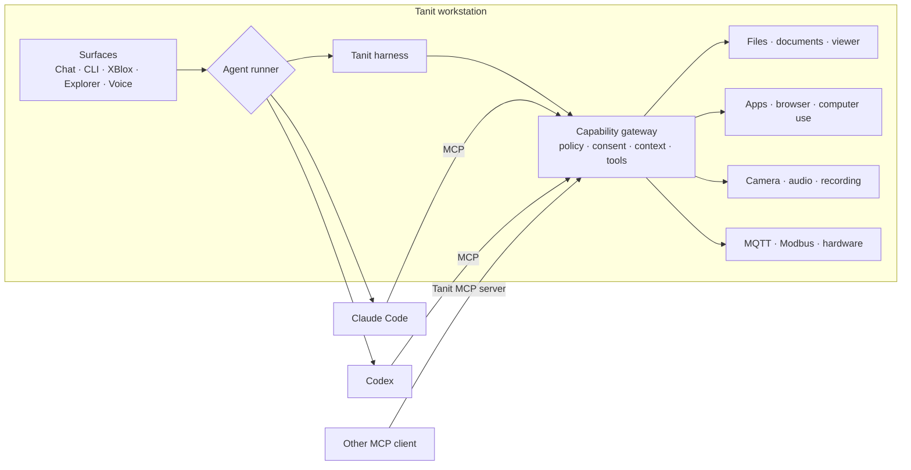

<!-- markdownlint-disable MD025 -->

# AI that belongs to the workstation

Codex and Claude are agents. Cursor is an AI-native code editor and agent
workspace. Ollama is a model runtime. Unsloth builds and optimizes models.
Hermes is an agent and automation environment.

**Tanit is the application layer around the work itself.**

Files, media, applications, and devices remain first-class objects.
AI can participate in a task without turning the task into a chat session.
Local and cloud models can be mixed per capability inside one governed Windows
workspace.

---

## Build once, carry the solution

**A Tanit solution is configuration, not a fragile transcript.**

| Portable part | What it carries |
|:--------------|:----------------|
| **Preset** | Agent runner, models, planner, media routes, tools, MCP, skills, prompts, limits, and consent behavior |
| **XBlox flow** | Reviewed steps for files, documents, media, HTTP, applications, MQTT, Modbus, and AI |
| **Command** | A named action for the ribbon, Explorer, voice, CLI, or scheduler |
| **Profile** | Encrypted and signed configuration that can be backed up, restored, or deployed |

The same solution runs in Chat, headlessly from `tanit-cli`, from Explorer, or
on a schedule. Model files, credentials, and machine policy remain separately
managed, so moving a solution does not leak secrets or weaken the destination
PC.

---

## Known work should not become prompt work

A repeated job should not pay for a fresh conversation, full chat history,
every tool schema, and another round of prompt engineering.

| Job | Focused flow |
|:----|:-------------|
| **Document** | Extract → classify → transform → file or send |
| **Image** | Inspect → select → resize or generate → export |
| **Audio** | Record → clean → transcribe → summarize → save |
| **Video** | Capture → filter or inspect → encode → publish |
| **Workshop** | Read sensor → consult approved manual → ask for consent → write result |

Hermes also supports script-only scheduled jobs with no model call. Tanit’s
specific advantage is **XBlox**: deterministic and AI steps share one visual,
inspectable workstation flow. Each step can use the smallest local model or
most cost-effective provider that can perform it.

---

## At a glance

Legend: **●** built in · **◐** available, but narrower or externally assembled ·
**—** not the product’s focus

| Capability | Tanit | Codex | Claude | Cursor | Ollama | Hermes | Unsloth |
|:-----------|:-----:|:-----:|:------:|:------:|:------:|:------:|:-------:|
| Windows workspace for daily work | ● | ◐ | ◐ | ◐ | — | ◐ | ◐ |
| Repository coding agent | ◐ | ● | ● | ● | — | ● | ◐ |
| Local text and vision models | ● | ◐ | ◐ | ◐ | ● | ◐ | ● |
| Cloud and private model endpoints | ● | ◐ | ● | ● | ◐ | ● | ● |
| **Different provider per capability** | ● | — | ◐ | — | — | ◐ | ◐ |
| Integrated viewer: images, video, audio, PDF, documents, and code | ● | ◐ | — | — | — | — | — |
| Work directly with local and remote files | ● | ● | ◐ | ● | — | ● | ◐ |
| Voice and real-time voice | ● | — | ◐ | — | — | ● | — |
| Application and browser operation | ● | ● | ◐ | ◐ | — | ● | — |
| Camera, MQTT, and Modbus integration | ● | — | ◐ | — | — | ◐ | — |
| Deterministic automation without model calls | ● | ◐ | ◐ | ◐ | — | ● | — |
| Visual mixed deterministic + AI workflow | ● | — | — | — | — | — | — |
| Portable agent presets and flows | ● | ◐ | ◐ | ◐ | ◐ | ● | ◐ |
| Scheduled and headless execution | ● | ● | ◐ | ● | — | ● | ◐ |
| Central Windows policy | ● | ◐ | ● | ◐ | — | — | — |
| Integrated CMS / managed publishing | ● | — | ◐ | — | — | — | — |
| Model fine-tuning | — | — | — | — | — | — | ● |

The distinction is not that other agents cannot touch files or operate an
application. Tanit exposes these as first-class workstation capabilities,
independent of a coding-agent workflow.

---

## Bring the agent you prefer

Tanit ships with its own agent harness. It is the default, not a lock-in.
A preset can switch the runner to an installed **Claude Code** or **Codex**
agent while keeping Tanit as the workstation around it.

| Mode | Who runs the agent loop | What Tanit contributes |
|:-----|:------------------------|:-----------------------|
| **Native** | Tanit’s built-in harness | Models, planner, tools, MCP clients, skills, consent, memory, and all workstation surfaces |
| **Claude / Codex runner** | The installed external agent | Tanit workspace context and the enabled Tanit tool surface through MCP |
| **Tanit as MCP server** | Any compatible external client | Governed file, media, computer-use, application, camera, recording, and configured hardware capabilities |

This lets users keep the agent they prefer without rebuilding the surrounding
desktop integration. Claude or Codex can gain access to Tanit’s computer and
application tools, media capture, files, commands, and device workflows; Tanit
continues to decide which capabilities the active preset and machine policy
expose.

---

## Primary orientation

| Product | Primary orientation |
|:--------|:--------------------|
| **Tanit** | Governed Windows operational workspace |
| **Codex** | Software-development agent expanding into computer use and repeatable work |
| **Claude** | General reasoning, knowledge-work, and coding agent |
| **Cursor** | AI-native code editor, coding agents, and cloud development workflows |
| **Ollama** | Local model runtime and API |
| **Hermes Agent** | Personal, desktop, messaging, and automation agent |
| **Unsloth Studio** | Model training, optimization, comparison, and inference |

These are different layers, not mutually exclusive replacements.

---

## How they complement Tanit

| Product | Strongest focus | How it complements Tanit |
|:--------|:----------------|:-------------------------|
| **Codex** | Development, parallel agents, computer use, browser tasks, SSH, and scheduled work | Tanit can hand it repository work while retaining the wider files, media, device, and policy surface |
| **Claude** | Reasoning, knowledge work, coding, MCP, skills, and enterprise-managed desktop sessions | Tanit adds capability-specific routing, local media, deterministic visual flows, and policy across the whole workstation |
| **Cursor** | AI-native editing, repository agents, cloud agents, and application deployment through Vercel | Tanit adds the wider operational workspace, capability routing, devices, CMS, and governed non-code workflows |
| **Ollama** | Pulling and serving open models through a local API | Tanit supplies the user interface, tools, workflows, consent, and deployment layer |
| **Hermes Agent** | Personal automation, memory, profiles, voice, cron, messaging, files, and previews | Tanit adds a Windows-native operational workspace and visual flows that mix deterministic and AI steps |
| **Unsloth Studio** | Fine-tuning, comparing, running, and exporting models | Tanit deploys the resulting models into documents, media, voice, commands, and workflows |

Tanit can use compatible local endpoints, install GGUF models exported by
training tools, and run installed Codex or Claude Code agents.

---

## Publishing and delivery

Once an agent produces something useful, it still has to become something
other people can open, review, or use.

| Product | Delivery model |
|:--------|:---------------|
| **Tanit** | Integrated content and CMS layer: publish local Markdown as pages, create posts, upload pictures and VFS files, search and update content, and place publishing inside governed XBlox flows |
| **Claude** | Hosted artifacts: live interactive pages on `claude.ai`, with private, organization, or public-link sharing where the plan and policy allow it |
| **ChatGPT / Codex ecosystem** | ChatGPT Sites publishes generated sites to production URLs and, where available, custom domains; Codex CLI alone is not a CMS |
| **Cursor** | Application deployment through Vercel plugins, CLI, MCP, or connected repositories; this is deployment integration, not a built-in CMS |
| **Hermes Agent** | Scripts and tools can deliver output to files, messaging platforms, or an external publishing service |
| **Ollama / Unsloth** | Model runtime and training layers; publishing belongs to the calling application |

Tanit’s distinction is the full path from a local file, recording, generated
asset, or reviewed flow into managed pages, posts, pictures, and files—without
leaving the workstation or turning the result into a separate deployment
project.

---

## Model choice is per capability

| Capability | Tanit route |
|:-----------|:------------|
| **Text and agent** | Local llama.cpp GGUF, cloud providers, aggregators, or private OpenAI-compatible endpoints |
| **Planning** | A separate fast local or cloud model selects a focused tool set |
| **Vision and OCR** | Local VLM, ONNX OCR, or an external vision provider |
| **Speech-to-text** | Local whisper.cpp or a configured external service |
| **Text-to-speech** | Local speech engines or configured voices |
| **Images and video** | Independent generation and recognition routes instead of forcing media through the chat model |
| **Shared inference** | One stronger PC serves managed LAN seats with `llm agent --serve` |
| **Offline use** | A local-only preset requires no cloud account |

The Models page reads GGUF quantization, size, sharding, capabilities, and
estimated VRAM.

---

## Security and fleet control

| Control | Tanit | Codex | Claude | Cursor | Ollama | Hermes | Unsloth |
|:--------|:-----:|:-----:|:------:|:------:|:------:|:------:|:-------:|
| Tool allow / deny / ask policy | ● | ● | ● | ● | — | ● | ◐ |
| Consent UI naming action and target | ● | ● | ● | ● | — | ● | ◐ |
| Sandboxed command / code execution | ● | ● | ● | ● | — | ● | ● |
| Built-in and MCP tools share one policy path | ● | ◐ | ◐ | ◐ | — | ◐ | — |
| Encrypted and signed portable configuration | ● | — | — | — | — | — | — |
| Windows Hello key protection | ● | — | — | — | — | — | — |
| Windows machine policy / MDM controls | ● | ◐ | ● | ◐ | — | — | — |
| UI panels and Settings can be locked down | ● | — | ◐ | ◐ | — | — | — |
| Policy spans viewer, models, voice, devices, commands, MCP, CLI, and automation | ● | ◐ | ◐ | ◐ | — | ◐ | — |

Claude has substantial Windows registry and MDM policy of its own. Tanit’s
distinction is the breadth of its integrated policy surface: one path covers
the viewer, models, voice, devices, commands, MCP, CLI, and XBlox. A preset
cannot re-enable a capability disabled by machine policy.

That makes the product practical for schools, laboratories, workshops, and
corporate fleets without first assembling a separate interface and security
layer.

---

## Runtime and supply chain

### Product architecture

| Technical concern | Tanit approach |
|:------------------|:---------------|
| **Core runtime** | Compiled C++ |
| **Web interface host** | Microsoft Edge WebView2 for selected interfaces; it is not a Node.js application runtime |
| **After installation** | No Python environment, `pip install`, `npm install`, package restore, or container bootstrap |
| **Flow startup** | No package downloads when a preset or XBlox flow starts |
| **Feature surface** | Editions compile out unused capabilities |
| **Dependencies** | Native dependencies and signed plugins can be inventoried and shipped deliberately |
| **Updates** | Desktop, CLI, tools, policy, and automation move as one versioned product |
| **Concurrency** | Independent agent sessions and XBlox jobs can run together; independent tool calls can dispatch in parallel |

Large local model weights remain separate payloads. Their download and load
time depend on model size, storage, RAM, and GPU.

### Observed disk usage on our Windows test machine — September 27, 2026

These figures are observations, not vendor requirements. They exclude model
weights, datasets, projects, and conversation data. WebView2 is supplied by
Windows and is not included in the Tanit base figure.

| Product | Main implementation | Observed disk usage |
|:--------|:--------------------|--------------------:|
| **Tanit base** | C++ core; HTML / TypeScript assets hosted in WebView2 | **~100 MB** |
| **Codex CLI** | Native Rust executable | ~293 MB |
| **Claude Code** | TypeScript-based agent distributed as a packaged executable | ~235 MB |
| **Cursor** | Electron / TypeScript editor with native helpers | ~858 MB active installation; project metadata and caches observed up to ~100 GB on large workspaces |
| **Ollama** | Go service and CLI with native C / C++ compute backends | ~3.1 GB before models |
| **Hermes Agent** | Python agent; TypeScript / Electron desktop | ~2.6 GB measured; roughly 5 GB with environment and caches |
| **Unsloth Studio** | Python / PyTorch stack, web UI, and llama.cpp inference | ~4.8 GB before models and datasets |

Codex / ChatGPT and Claude desktop applications are separate from the CLI
figures. Cursor was measured from the active `Program Files` installation.
Optional Tanit plugins and local models are separate from the ~100 MB base.

On large indexed projects, Cursor has also been observed using roughly
**3–5 GB RAM**, with workspace startup taking up to **~15 seconds**. These are
working-set observations, not Cursor installation requirements; project size,
extensions, indexing state, and open agents materially affect them.

### Startup

On the current Tanit test system, the installed workspace reaches a usable UI
in approximately **two seconds**. This is an informal product observation, not
a cross-product benchmark. A publishable competitor comparison needs the same
hardware, cold / warm definition, login and resident-process state, network
conditions, start / end points, and repeated-run protocol.

---

## Choose Tanit when

- Users need a finished application, not an AI integration project.
- Work starts with documents, media, applications, or devices—not only a
  prompt or git repository.
- Local and cloud models must coexist behind one experience.
- A useful interaction must become a portable, reviewed procedure.
- Deterministic and AI steps must remain visible in the same workflow.
- IT needs one policy surface across the entire Windows workspace.

**Choose the models you trust. Package the solution once. Deploy it wherever
the work happens.**

---

## Learn more

[Tanit AI](./feature-ai.md) ·
[Automation](./feature-automation.md) ·
[Deployment](./feature-integration.md) ·
[Security](./feature-security.md) ·
[Files](./feature-files.md) ·
[Images](./feature-images.md) ·
[Audio](./feature-audio.md) ·
[Video](./feature-video.md)

## Comparison sources

- [Codex for (almost) everything](https://openai.com/index/codex-for-almost-everything/)
- [Codex on Windows](https://developers.openai.com/codex/whats-new)
- [Codex Windows sandbox](https://openai.com/index/building-codex-windows-sandbox/)
- [Claude Desktop](https://code.claude.com/docs/en/desktop)
- [Claude Desktop managed configuration](https://claude.com/docs/third-party/claude-desktop/configuration)
- [Claude Desktop MDM deployment](https://claude.com/docs/third-party/claude-desktop/mdm)
- [Claude Code artifacts](https://code.claude.com/docs/en/artifacts)
- [ChatGPT Sites](https://learn.chatgpt.com/docs/sites)
- [Vercel plugin for Cursor and other coding agents](https://vercel.com/docs/agent-resources/vercel-plugin)
- [Vercel for Cursor Origin](https://vercel.com/docs/git/vercel-for-origin)
- [Ollama OpenAI compatibility](https://docs.ollama.com/api/openai-compatibility)
- [Hermes Desktop](https://hermes-agent.nousresearch.com/docs/user-guide/desktop)
- [Hermes script-only cron jobs](https://hermes-agent.nousresearch.com/docs/guides/cron-script-only)
- [Unsloth Studio](https://unsloth.ai/docs/new/studio)
