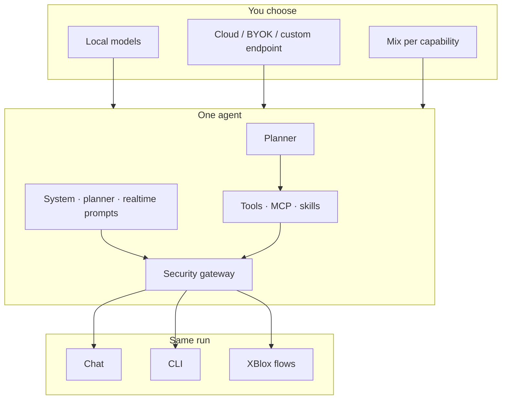
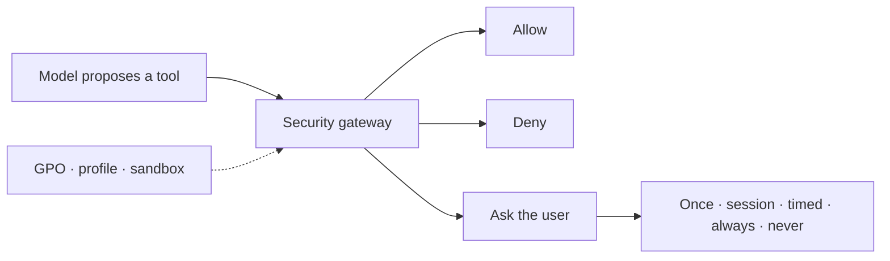
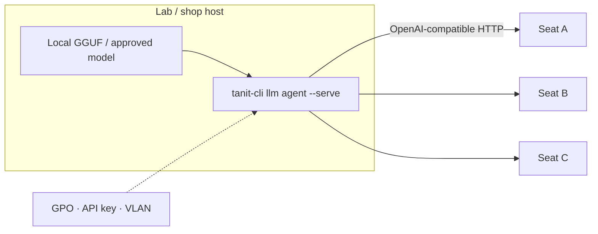

<!-- markdownlint-disable MD025 -->

# AI that works where people already are

AI becomes more useful when it is not confined to a chat box.

Tanit brings AI into the Windows workspace — next to files, images, audio,
cameras, applications, devices, and repeatable workflows.

It can help someone understand a difficult document, participate in a meeting,
work through a task step by step, operate a computer through voice, inspect a
machine manual beside live data, or turn a successful conversation into a
repeatable workflow.

The goal is not simply to add another assistant. It is to make powerful AI
**usable in more places, by more people, with fewer barriers**.

- **Lower technical barriers** — use voice, simple interfaces, guided actions,
  presets, and automation instead of requiring everyone to understand tools,
  models, prompts, or software stacks.
- **Lower language and communication barriers** — translate, transcribe,
  simplify, read aloud, help formulate a contribution, or move between text,
  speech, images, and documents.
- **Lower institutional barriers** — shape the same system for a home,
  classroom, care setting, workshop, laboratory, or managed organization
  without exposing every user to the underlying complexity.
- **Keep people in control** — choose what models are used, what data stays
  local, what tools are available, and which actions require approval.
- **Make successful work repeatable** — a useful interaction can become a
  preset, command, or visual workflow instead of being lost when the chat ends.

---

## One system, many forms

The same underlying AI can be shaped very differently for different people
and environments.

| Setting | Example |
|:--------|:--------|
| **Everyday work** | Understand documents, organize files, create media, translate, dictate, and automate repetitive tasks |
| **Accessibility and assisted use** | Voice-first interaction, read-aloud, simplified workflows, guided tasks, communication support |
| **Education** | A controlled learning workspace with selected models, tools, content, and step-by-step assistance |
| **Group discussion** | Capture spoken and typed contributions, translate or help phrase them, surface questions and comments that would otherwise be lost |
| **Care and supported living** | Simple communication, reminders, familiar media, guided activities, and approved contact or escalation workflows |
| **Science and research** | Combine local OCR, vision, documents, tools, and chosen reasoning models in repeatable experiments |
| **Manufacturing and field work** | Put AI beside manuals, files, cameras, sensors, and deterministic automation |
| **Managed organizations** | Deploy the same application with approved providers, tools, policies, and interfaces |

Tanit is not specialized software for each of these domains. It provides the
building blocks to create those experiences from the same workstation.
Partners own the vertical; you supply the machine, the policy, and the tools.
[Deployment](./feature-integration.md).

---

## AI you can shape, govern, and repeat

Choose the model for each job.

Use local models, approved cloud providers, private endpoints, or mix them by
capability. A document can stay on the PC while a different model handles
writing. Speech can run locally while another provider handles reasoning.
Vision can stay inside a lab or workshop.

Give the agent only the tools it needs and decide what it may read, write,
run, or send.

**The same agent runs in Chat, the CLI, and XBlox flows.** Once a setup works,
save it as a preset, reuse it, automate it, or deploy it to other machines.

> Available capabilities can vary by edition and organization policy.

---

## What you get

| You need | What Tanit ships |
|:---------|:-----------------|
| **Keep sensitive work local** | llama.cpp text and VLM (GGUF), whisper.cpp, ONNX media, local speech |
| **Use the best model for a job** | Direct providers, BYOK, OpenAI-compatible endpoints — routed **per capability** |
| **Share expensive hardware** | One capable PC serves lab or shop seats over the LAN (`llm agent --serve`) |
| **Reuse successful setups** | Presets bundle models, planner, tools, MCP, skills, and media routing |
| **Move from chat to automation** | Chat, `tanit-cli llm agent`, and XBlox `llmAgent` — same preset, tools, and policy |
| **Control what AI may do** | Files, vision, audio, shell, MCP, sensors — allow, deny, or consent per action |
| **Adapt the interface** | Chat-only, viewer, or full workbench; hide panels and Settings by GPO |

---

## Local and external models

Every capability can use a different provider. A private lab can keep images
and transcripts on the PC and still call an approved reasoner for writing. A
shop can run vision locally and never send frames off-site.

| Capability | Typical local path | Typical external path |
|:-----------|:-------------------|:----------------------|
| Text / agent | llama.cpp GGUF | OpenAI, Gemini, OpenRouter, custom OpenAI-compatible |
| Planning | Fast local or small cloud model | Dedicated planner model |
| Vision / VLM | Local visual-language GGUF | Cloud vision model |
| OCR | ONNX or local VLM | Cloud OCR |
| Image / video generation | Where a local path exists | Replicate and other configured providers |
| Speech-to-text | whisper.cpp | Cloud STT |
| Text-to-speech | Local speech / VibeVoice | ElevenLabs and other configured voices |
| Realtime voice | — | Provider realtime API (own model and voice) |

**Hugging Face** — find and install supported GGUF builds from the Models page.
Tanit inspects variants, quantization, size, sharding, capabilities, and
estimated VRAM so you can pick a build that fits the machine.

**Custom endpoints** — point a provider at a private or LAN OpenAI-compatible
base URL (`Providers.EnableCustom`). That is how thin clients talk to a shared
Tanit host, or to an approved internal gateway.

**Mix in one preset** — local whisper + cloud reasoning, local OCR + cloud
image generation, local chat + MCP research tools. Switch presets when the job
changes instead of rebuilding the workspace.

Settings: [Chat settings](../llm/settings-chat.md).
Chat: [Tanit Chat](../llm/feature-chat.md).

---

## AI can see, hear, read and work with the environment

The agent already sits next to Tanit’s files, viewer, and automation. You do
not assemble a second stack for media or the shop floor.

| Domain | What the agent can use |
|:-------|:-----------------------|
| **Vision** | Selected, dropped, pasted, or captured images; local or cloud VLM; OCR |
| **Audio** | Mic or file transcription; TTS; realtime voice with its own provider and prompt |
| **Files** | Current folder and selection; SSH/FTP/MTP through the same workspace |
| **Camera** | Capture a still from a connected camera into the turn |
| **Plant / lab I/O** | XBlox **Modbus** (coils, registers) and **MQTT** (client and in-process broker) in the same flow as an LLM block |

A typical manufacturing pattern: read a register or topic → ask the agent
against on-disk manuals → write a note — under STRICT policy, with MCP and
shell off if they do not belong on that PC.

[Images](./feature-images.md) · [Audio](./feature-audio.md) ·
[Video](./feature-video.md) · [Files](./feature-files.md) ·
[XBlox](../xblox.md).

---

## From conversation to repeatable workflows

Chat, CLI, and XBlox **do not fork separate agents**. Defaults come from
Settings and the named preset. Block and CLI flags only override. Consent on
headless XBlox runs uses the same Win32 permission dialog as the CLI.

| Surface | Use it when |
|:--------|:------------|
| **Chat** | Interactive work with files, filmstrip, live tool log, stop/cancel, memory |
| **CLI** | Scripts, scheduled tasks, CI, headless `--serve`, `--realtime`, `--mic` |
| **XBlox** | Multi-step jobs: embed files, route OCR/vision/TTS, then Modbus/MQTT/files |

Turn a successful chat into a ribbon or Explorer command when the job should
happen again on the next folder.
[Commands](../commands/commands-intro.md).



---

## Built to be controllable and repeatable

**Use only what the task needs** — a planner can pick a small tool set before
the main model runs, so everyday work is not loaded with every schema.
Parallel tool calls are available when the task needs them. Cap iterations
per turn.

**Change the part that needs changing** — locate a section, read a window of
lines, replace a unique snippet. Not “rewrite the whole handbook.” Tool
calls, planner choices, and model rounds stay visible in the Log. Consent
names the action and the target.

**Reuse what already works** — a preset is the whole agent. Save it, restore
it, ship it in an encrypted profile, or capture a successful chat as an XBlox
flow for the ribbon, Explorer, or a scheduled CLI job.

**Choose where the cost goes** — a small local model for planning or OCR, a
shared lab host for classwork, cloud only where it earns its keep. Keep
prompts and files on-prem when that is both cheaper and safer.

What the assistant may do is decided in
[Security and policy](#security-and-policy--the-assistant-does-not-run-the-pc).

---

## Security and policy — the assistant does not run the PC



The assistant *proposes* actions. Tanit *allows, denies, or asks*.

- **Profiles** — Light, Strict, or Developer; grant lists you can export with
  the image.
- **Consent** — native Windows dialog or Chat card, naming action and target.
  Optional advisory review by a separate security model; a human still decides.
- **Sandbox** — isolate higher-risk tools (AppContainer / LPAC) and limit extra
  writable folders.
- **GPO / Intune / ADMX** — approved providers, local llama on/off, MCP hosts,
  skills, computer-use, realtime voice, CLI verbs, UI panels. HKLM security
  keys cannot be lowered by a non-admin user.
- **At rest** — settings, commands, MCP config, and prompt templates encrypt and
  sign when secure storage is enabled.

[Tanit Chat — schools](../llm/feature-chat.md#tanit-chat-for-schools-and-security-sensitive-environments)
· [GPO](../gpo-setup.md)
· [Tanit Security](../security/security.md).

---

## Customize models, prompts, tools, and UI

A **preset** is the whole agent: models, planner, tools, MCP, skills, consent.
Restore it in Chat, pass `--preset` on the CLI, or select it on an XBlox LLM
block.

An optional **planner** picks a focused tool set first. Point it at a fast
model. Override its prompt (literal text, `@file`, or `null`); `${builtin}`
keeps the shipped instructions and lets you extend them.

Three signed prompt documents steer behavior: **system** (persona and rules),
**planner** (tool choice), **realtime** (live voice). Override per run with
literal text, `@path`, or `null`. Stored under `pm://config/prompts/…` when
secure storage is on.
[Settings](../settings.md).

**Skills** are instruction packs (roaming or workspace). **MCP** servers
(stdio, SSE, HTTP) expose only the tools you enable; restrict hosts with
`Agent.AllowedMcpHosts`. Built-in **tools** cover files, images, audio, video,
commands, and questions to the user — enable by group or allowlist per run.
[Agent tools](../tools.md).

The same binary opens as workbench, **chat-only**, or viewer
(`tanit --ui-preset chat|viewer|main`). Hide panels and Settings with launch
flags or GPO (`UI.Panels.*`).
[UI launch](../ui.md).

---

## Shared model host

Classrooms, labs, and small shops often have **one** machine that can run a
strong local model. Tanit **serves that host to multiple seats**: the same
agent runtime exposes an OpenAI-compatible HTTP server. Other PCs keep the
managed desktop app and point at the host as a Custom provider. Concurrent
turns are gated (`--concurrency`); this is shared serving, not GPU scheduling
across processes.



```powershell
tanit-cli --no-gui llm agent --serve --host 0.0.0.0 --port 8090 `
  --preset "Local …" --serve-api-key $env:TANIT_SERVE_API_KEY
```

Turns on the host inherit the preset’s tools, MCP, and skills. Default consent
on the server is deny-until-allowed. Prefer an API key; firewall the port to
the lab VLAN.
[CLI](../cli/cli.md) (`llm agent --serve`).

---

## A native, deployable runtime

Tanit’s runtime, security gateway, secure storage, and tool execution are a
**compiled C++ core**. Local text and vision run on **llama.cpp**; speech
recognition on **whisper.cpp**; focused media jobs on **ONNX Runtime**.
Presentation uses the OS WebView; native capabilities are reached only through
a policy-checked bridge. There is no Node runtime in the product — not an
Electron app, and not a Python agent with hundreds of transitive packages on
every seat.

That is proof of the architecture, not the product pitch: one installer, one
policy surface, a dependency set you can inventory. Integrity and WebView
boundary: [Tanit Security](../security/security.md).

---

## Related docs

- [Tanit Chat](../llm/feature-chat.md) — workspace chat, files as context
- [Chat settings](../llm/settings-chat.md) — providers, planner, MCP, skills, security
- [Agent memory](../llm/feature-agent-memory.md)
- [Agent tools / MCP](../tools.md)
- [Partner / MSP / OEM deployment](./feature-integration.md)
- [Security: encryption and backup](./feature-security.md)
- [Tanit Security](../security/security.md) · [GPO](../gpo-setup.md)
- [CLI](../cli/cli.md) · [UI launch](../ui.md)
- [XBlox](../xblox.md) · [Files](./feature-files.md) · [Images](./feature-images.md) · [Audio](./feature-audio.md) · [Video](./feature-video.md)
