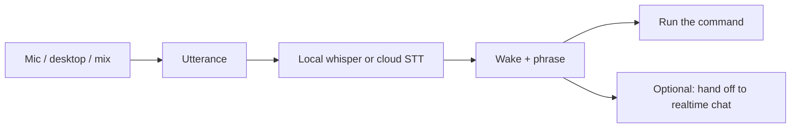

<!-- markdownlint-disable MD025 -->

# Audio: record it, speak it, command it

Tanit listens and talks in the same workspace as files and chat. Capture a
meeting and walk away with a transcript. Read a document aloud in a local or
cloud voice. Say **Tanit screenshot** and run a command without touching the
keyboard.

Speech is **local or cloud, per use**. The same jobs run in the app, the CLI,
and XBlox flows.

> Available capabilities can vary by edition and organization policy.

---

## Who it's for

- Anyone who'd rather talk than type — notes, drafts, journals.
- People recording calls or meetings who want a file **and** a transcript
  (optional SRT/VTT sidecar).
- Creators who need a voiceover — a library voice, or a clone from a few
  seconds of reference audio on this PC.
- People who want **hands-free commands** while Tanit is open (wake phrase,
  then a command name) — not a live chat session.
- People on a laptop mic talking to the **realtime voice agent**, who need
  speech to reach the model, not the keyboard and fan.
- Accessibility — have articles, chat replies, or long documents read back.

---

## The jobs (they are different pipes)

| Job | When | Path |
|:----|:-----|:-----|
| **Record** | You want a file, and maybe a transcript | Mic, desktop, or mix → WAV or AAC at listen quality (48 kHz) |
| **Transcribe / speak** | Speech ↔ text | Local whisper.cpp or cloud STT; local VibeVoice / MOSS or cloud TTS |
| **Voice commands** | Run a Tanit command by speaking | Always-listening command center: wake phrase → one action → idle |
| **Talk live** | Chat is in a voice conversation *now* | 16 kHz speech uplink into the realtime agent |
| **Clean (post)** | You already have a take, or just finished one | DeepFilterNet at 48 kHz — files, video, after `audio record` |
| **Clean (realtime)** | Live speech the model must understand *now* | GTCRN at 16 kHz — chat uplink; optional on voice-command clips |

A meeting master you will listen to is not the same as a live agent turn or a
spoken “screenshot.” Tanit does not pretend they are.

---

## Same audio, three surfaces

Chat settings pick default STT/TTS providers. Devices and the command center
live under **Settings → Audio & Video**. CLI flags and XBlox blocks **override**
those defaults — they do not fork a second stack.

| Surface | Use it when |
|:--------|:------------|
| **App** | Overlay HUD, ribbon/hotkey, `togglevoicecommand`, chat realtime |
| **CLI** | `tanit-cli audio …` and `tanit-cli voice …` for scripts and scheduled jobs |
| **XBlox** | `audioRecord`, `audioTranscribe`, `audioSpeak`, `voiceListen`, … in a flow |

---

## Record

Record from the microphone, from desktop / system sound (a call or app), or
**mix** both. Mic and desktop levels are independent.

Default capture is **48 kHz stereo** — the same quality as video desktop mux.
Long WAV takes spill PCM to disk after about 30 seconds in RAM. On Windows,
`.m4a` / `.aac` encodes AAC during capture instead.

Stop with duration, Ctrl+C, the overlay Stop button (`--hud`), or
`audio record stop` from another terminal. `audio record status` shows the
active take.

Optional **speech-to-text in the same step**: local whisper.cpp (offline),
Tanit proxy, or ElevenLabs live captions. Write a transcript (`--text-out`),
print it, and/or emit YouTube-accepted **SRT / VTT / SBV** sidecars. Batch
transcribe an existing WAV with `--from-wav` (local / proxy providers).

The same sources hang on **video record**. See [video](./feature-video.md).
Examples: [audio record](../cli/audio_record_examples.md).

XBlox: timed `audioRecord`, or `audioRecordStart` / `audioRecordStop` for a
named session (hotkey start/stop).

---

## Speech to text, text to speech

### Transcribe

| Provider | Typical use |
|:---------|:------------|
| **whisper** (local whisper.cpp) | Offline; CPU or GPU; language `auto` / `en` / `de` / … |
| **tanit** (proxy) | Batch Whisper through Tanit when configured |
| **elevenlabs** | Live streaming captions |

`audio info --models` lists discovered local ggml models. Chat STT settings
are the default when CLI/XBlox omit `--provider`.

XBlox `audioTranscribe` accepts a file or a live capture (mic / desktop /
mix), same engines.

### Speak

Give it words (or a `.txt` / `.md` file), get a voice: play through speakers,
save MP3/WAV/Opus, or both.

| Provider | Typical use |
|:---------|:------------|
| **elevenlabs** / **tanit** | Cloud catalog, streaming playback for first-audio latency |
| **vibevoice** | Local ggml TTS; optional reference WAV to clone |
| **moss** | Local MOSS-TTS-Nano; optional reference WAV to clone |

No cloud key is required for the local paths. `--ref-audio` (CLI) /
`refAudio` (XBlox) is the clone clip.

**Scripted TTS** (`audio tts-scripted` / `audioTtsScripted`) places cues from
an SRT/VTT/JSON script onto a 48 kHz timeline — narration that has to hit
timecodes.

Re-voice an existing recording with `audio voice-change` (ElevenLabs): same
timing and delivery, new voice — cleanup, alternate readings, or
anonymizing, without re-recording.

---

## Voice commands

This is the always-listening **command center**. It is **not** realtime chat
(`togglerealtime`). You say a wake phrase (default **Tanit**), then a command
name. Tanit matches that phrase and runs the command the same way a ribbon
button or shortcut would — then goes back to idle.



**In the app** — enable it under **Settings → Audio & Video → Voice
commands**, then start listening with **Voice Commands**
(`togglevoicecommand`). `voicecommandstart` / `voicecommandstop` are the
explicit pair. Saving Audio & Video reloads a listener that is already
running.

Built-in app verbs (screenshot, panels, search, …) work without extra setup.
Your own commands are **opt-in**: Settings → Commands → Triggers → **Voice
command**. Leave spoken phrases empty to use the label, or list aliases.

| You say | What runs |
|:--------|:----------|
| `Tanit screenshot` | Take screenshot |
| `Tanit explorer` | Toggle the file tree |
| `Tanit search cats` | Open search with **cats** in the query |
| `Tanit stop listening` | Stop the listener |

Leave the wake phrase **empty** if you want no prefix — easier to trigger by
accident. Route **Trigger mapped commands** (default) or **Hand off to
realtime agent** (starts a live voice chat with the recognized text, then
listening resumes).

**CLI** — same loop without the UI:

```text
tanit-cli voice listen
tanit-cli voice replay --text "Tanit screenshot"
tanit-cli voice stop
```

`voice replay` checks matching with no microphone (or from a WAV). Omit
`--wake-phrase` for no prefix.

**XBlox** — `voiceListen`: Still (one match), Start (named instance until
Stop), Replay (inject text). Child blocks run with the trigger envelope;
optional `dispatch` also runs the catalog command.

How-to, settings table, and variables (`${VOICE_COMMAND}`, `${VOICE_FULL}`):
[Voice Commands](../commands/commands-intro.md#voice-commands).
App verbs: [App commands](../app-commands.md).

---

## Talk live (realtime)

The voice agent in chat is a live loop: mic in, model voice out. Capture is
**16 kHz mono** speech, with echo cancel so playback does not come back as
“you.” Background noise on this path is **GTCRN** — see
[Background noise](#background-noise-post-vs-realtime).

A virtual microphone into Zoom / Teams is **not** shipped. Start from Chat or
`tanit --type realtime` / `--mic start`. Distinct from voice commands.

---

## Background noise (post vs realtime)

Two cleaners, two rates. They are not interchangeable.

| | **Post** (listen-quality file) | **Realtime** (speech the model hears) |
|:--|:------------------------------|:--------------------------------------|
| **Job** | Meeting master, voiceover, podcast, video narration | Chat uplink; optional voice-command clip |
| **Cleaner** | **DeepFilterNet** | **GTCRN** (trial) |
| **Rate** | 48 kHz full-band | 16 kHz speech (nothing above 8 kHz is invented) |
| **When it runs** | After `audio record` stops, or `audio filter` / `audioFilter` on a file. Video: hops on the mux worker, not the capture callback | After echo cancel, on a worker thread. **Replaces** the ordinary noise suppressor (stacking both muffles consonants) |
| **`--post-filter` / `--pf` / `postFilter`** | Yes — over-attenuate very noisy sections; implies DeepFilter | **No** — ignored on GTCRN |
| **Mix / desktop** | Mic or mix can be enhanced; desktop-only loopback stays dry | Mix: mic leg only; desktop-only stays dry |

Do **not** run GTCRN on a 48 kHz master, or DeepFilterNet on the live 16 kHz
uplink, and call it the same thing.

### Post (files and video)

- After capture: `audio record --filter deepfilter` (writes 48 kHz mono WAV,
  not AAC). `--model` is still the STT model; enhancer weights are
  `--filter-model`. Add `--pf` for the aggressive post-filter.
- Existing file: `audio filter --input in.wav --dst out.wav` (same `--pf`).
- Video with a mic: `video record … --audio-source mic --filter deepfilter`.
- XBlox: `audioRecord` / `audioFilter` with `postFilter`.

Download weights once: `tanit-cli hg download deepfilternet3`.

Cloud `audio voice-change` can also strip background when you are already on
that tool.

### Realtime (chat and spoken commands)

- **Chat realtime** — GTCRN on the 16 kHz uplink (`tanit-cli hg download gtcrn`).
- **Voice commands** — enhance the clip *after* you stop talking. **Auto**
  uses DeepFilter when available; **off** is dry/APM; **gtcrn** is the 16 kHz
  speech enhancer. `--post-filter` applies only to DeepFilter. Settings:
  **Audio & Video → Voice commands → Speech filter**. CLI: `voice listen
  --filter …`; XBlox `voiceListen` `filter` / `postFilter`.

---

## Bluetooth speakers and headsets

Point at a paired device by name (`--connect` on record / play / tts). Tanit
connects, wakes it from standby if needed, and routes audio — instead of
digging through Windows sound settings. `audio info --playback` (and `--all`
for unplugged paired devices) lists render endpoints.

---

## Privacy

Local paths exist end to end: whisper.cpp transcription, VibeVoice / MOSS
speech, DeepFilterNet / GTCRN clean. Nothing is sent anywhere for those
steps. Cloud STT, TTS, and voice-change are opt-in.

---

## CLI and XBlox (same jobs)

| Job | CLI | XBlox |
|:----|:----|:------|
| Devices | `audio info` | `audioListDevices` |
| Record | `audio record` / `stop` / `status` | `audioRecord`, `audioRecordStart` / `Stop` |
| Play | `audio play` | `audioPlay` |
| Filter | `audio filter` (`--pf`) | `audioFilter` (`postFilter`) |
| Transcribe | `audio record --stt` / `--from-wav` | `audioTranscribe` |
| Speak | `audio tts` | `audioSpeak` |
| Scripted speak | `audio tts-scripted` | `audioTtsScripted` |
| Re-voice | `audio voice-change` | (CLI; chain from a file) |
| Voice commands | `voice listen` (`--filter`, `--post-filter`) | `voiceListen` (`filter` / `postFilter`) |

[CLI](../cli/cli.md) · [audio record examples](../cli/audio_record_examples.md)
· [XBlox](../xblox.md).

---

## Related docs

- [Tanit AI](./feature-ai.md) — models, agent, realtime in context
- [Chat settings](../llm/settings-chat.md) — STT/TTS providers and devices
- [Voice Commands](../commands/commands-intro.md#voice-commands)
- [App commands](../app-commands.md) — `voicecommandstart` / `togglevoicecommand` / `togglerealtime`
- [Video](./feature-video.md)
- [Images](./feature-images.md)
- [Files](./feature-files.md)
