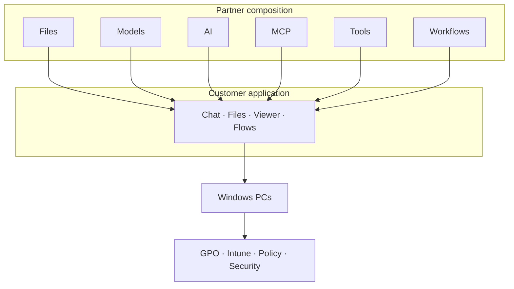
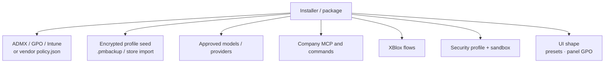
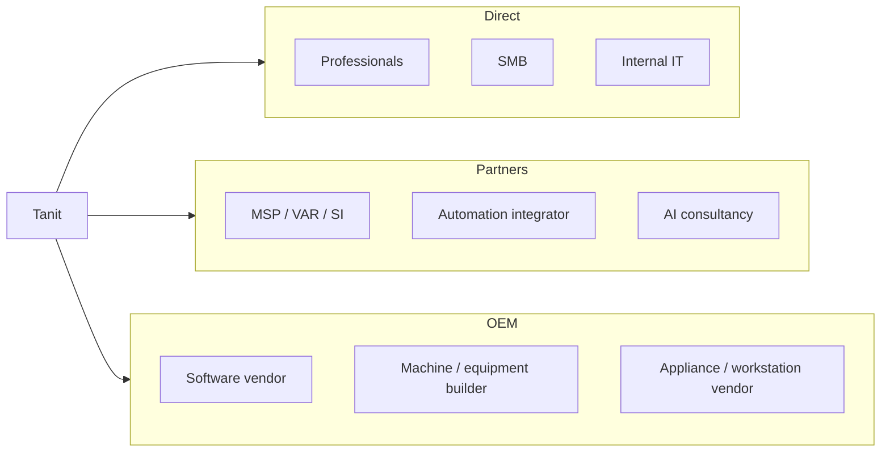
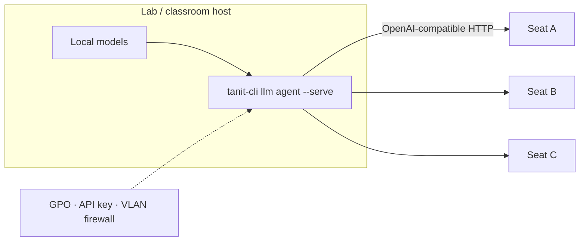
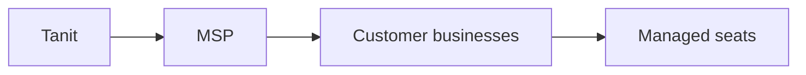

# Deploy AI as an application, not an integration project

**Tanit is a deployable Windows AI workstation for partners.**

MSPs, system integrators, automation partners, IT teams, and OEMs can turn it
into customer-specific AI solutions — with local files, **local or shared
models**, tools, automation, and policy in one installable application.

Deploy it on a handful of workstations or across a managed fleet. Shape the UI,
approved AI providers, tools, permissions, and workflows for each customer
without assembling a separate stack of containers, browser apps, and
integration glue.

**You configure the solution. Your customer gets an application.**

Configure their models, tools, company systems, workflows, permissions, and UI.
The employee opens Tanit and works with chat, files, the viewer, and your
buttons and flows — not an automation infrastructure.



This page is for people who put Tanit on many machines. What the AI can do
(local and cloud models, planner, MCP, skills, vision, audio, sensors):
[feature-ai](./feature-ai.md). Security detail:
[feature-security](./feature-security.md) and
[Tanit Security](../security/security.md). Policy keys:
[GPO setup](../gpo-setup.md).

---

## What you get

| You offer | What that means |
|:----------|:----------------|
| A **managed Windows AI workstation** | One product employees open and use |
| Desktop + CLI in the **same** environment | Interactive work and scripted jobs share one runtime |
| **Local models** on the PC | llama.cpp text/VLM, whisper, ONNX — privacy and offline without a cloud account |
| **Shared model host on the LAN** | One stronger machine can serve classmates or lab seats over the network |
| Local-first when the customer needs it | Files, models, and tools can stay inside their boundary |
| Central governance | GPO, Intune, ADMX, provider lists, UI and tool lockdown |
| Room to extend | MCP, commands, XBlox flows, CLI — without a second platform |

Under the hood this is a desktop + CLI **agent runtime**: the assistant proposes
actions; Tanit policy decides what is allowed. Presentation uses the OS
WebView; native capabilities are reached only through a policy-checked bridge.
Implementation detail (for technical due diligence): the runtime, security
gateway, secure storage, and tool execution are a compiled C++ core — see
[Built for managed desktop deployment](#built-for-managed-desktop-deployment)
and [Tanit Security](../security/security.md).

---

## Who this is for

Think less “B2C vs B2B” and more **who can put Tanit on 20–5,000 machines
without selling every seat one by one**.

| Audience | What Tanit becomes for them |
|:---------|:----------------------------|
| **MSPs / IT service companies** | Managed AI desktop they deploy, govern, and support |
| **System integrators / VARs** | Runtime they build customer solutions around |
| **Industrial / automation integrators** | Desktop and edge AI next to machines, files, and protocols |
| **Corporate IT / platform teams** | Governed employee AI workstation |
| **Schools / universities / labs** | Managed lab AI — local models, optional shared LAN host |
| **OEMs / machine builders / software vendors** | Runtime inside a branded or machine-bound solution |
| **SMB / professional offices** | Private document and folder automation |

Partners own the vertical — legal, manufacturing, media, logistics, and so on.
You supply the workstation and governance surface.

---

## Built for managed desktop deployment

Operational properties partners care about:

- **Lightweight desktop runtime** — suitable for ordinary office, lab, and edge
  PCs.
- **Local-first when required** — files, models, and tools can remain within the
  customer environment; local llama.cpp inference is a first-class path
  (`Local.EnableLlama`), not an afterthought.
- **One execution environment** — desktop UI, CLI, and headless automation use
  the same runtime (`tanit` / `tanit-cli`).
- **Network model serving** — `tanit-cli llm agent --serve` exposes an
  OpenAI-compatible HTTP surface; bind beyond loopback so other machines on the
  LAN can use a shared local (or approved) model host.
- **Controlled web boundary** — WebView presentation reaches native
  capabilities only through the policy-checked bridge.
- **Manageable software footprint** — no separate Electron/Node application
  stack to deploy and maintain alongside the product.
- **Familiar Windows administration** — GPO, Intune/MDM registry, ADMX templates,
  vendor `policy.json`, encrypted profile packages.

Underneath, Tanit’s runtime, security gateway, secure storage, and tool
execution are implemented in native C++; WebView2 is the presentation layer.
There is no Node runtime in the product and no Node integration through the
WebView. For dependency-surface and integrity rationale, see
[Tanit Security](../security/security.md).

---

## What a partner can compose

A customer site — machine shop, office floor, or school lab — can look like this
with shipped surfaces:



| Need | Guide |
|:-----|:------|
| Encryption, signing, Hello | [GPO](../gpo-setup.md), [signing](../security/signing.md) |
| Disable MCP, skills, tools, CLI verbs | [Policy list](../gpos.md) / ADMX |
| Sandbox (AppContainer / LPAC) | [Security CLI](../security/cli.md) |
| Encrypted portable config | [feature-security](./feature-security.md) |
| Import commands / MCP / prompts | [Settings migration](../settings.md) |
| Headless agents and batch | [CLI](../cli/cli.md), [tools](../tools.md) |
| AI capabilities (models, prompts, MCP, sensors) | [feature-ai](./feature-ai.md) |
| Local models + LAN model host | [Chat / local models](../llm/feature-chat.md), `llm agent --serve` in [CLI](../cli/cli.md) |
| Visual automation + Modbus / MQTT | [XBlox](../xblox.md) |
| Files (PC, SSH, FTP, Tanit VFS) | [feature-files](./feature-files.md) |
| Chat-only / viewer / main UI | [UI launch](../ui.md), GPO `UI.Panels.*` |
| Agent policy overview | [security](../security/security.md) |

Policy precedence (lowest → highest): compiled defaults → optional vendor
`dist\data\policy.json` → user settings → HKCU GPO → **HKLM GPO**. Security keys
that must not be weakened are **HKLM-only**.

---

## Distribution routes



- **Direct** — teams configure themselves; same security and CLI as everyone else.
- **Partners** — deployment and first-line support; e.g. “Managed AI Desktop”
  per seat.
- **OEM** — the customer-facing product is yours; Tanit is the runtime.

“Integrator Edition” is a **deployment concept**, not a second binary: same
application, partner-owned policy, tools, and support.

---

## Deployment playbook

### 1. Install and shape the UI

- Ship the product package; deploy ADMX via `PolicyDefinitions\` and
  `install_gpo.ps1` ([gpo-setup](../gpo-setup.md)).
- Push the same keys with Intune / MDM where that is your channel.
- Hide panels and Settings tabs end users should not change
  (`UI.Panels.*`, `UI.Settings.EnableAdvancedTab`, MCP/command editors).
- Launch shapes: `tanit --ui-preset chat|viewer|main`, optional `--layout` and
  panel flags ([ui](../ui.md)).

### 2. Set what the agent may do

- Choose a security profile (LIGHT / STRICT / DEVELOPER) and tool allow/block
  lists.
- Limit MCP hosts (`Agent.AllowedMcpHosts`); turn off computer-use or
  browser-use where they do not belong.
- Use sandbox mode when higher-risk tools must run isolated
  ([security](../security/security.md)).
- Validate with `tanit-security` before wide rollout
  ([security CLI](../security/cli.md)).

### 3. Seed company configuration

- Prefer encrypted **`.pmbackup`** (passphrase or `.cloud_storage_key`) over
  plaintext JSON on a share ([feature-security](./feature-security.md)).
- Or script `tanit-security` store imports into `pm://config/…`
  ([settings](../settings.md)).
- Do not copy `resources\documents\*.doc` between machines.

### 4. Connect customer systems

- **MCP** — ERP, REST, and other tools you maintain for that customer.
- **Commands** — ribbon and Explorer verbs for repeatable jobs
  ([commands](../commands/commands-intro.md)).
- **XBlox** — multi-step flows; Modbus/MQTT for plant and lab equipment; VFS
  for folders and remotes ([xblox](../xblox.md)).
- **CLI** — scheduled tasks and batch (`tanit-cli llm agent`, media, find, …).

### 5. Models and identity

- Install local models under **Settings → Models** (GGUF / llama.cpp, plus
  whisper and ONNX where needed). See [Tanit Chat](../llm/feature-chat.md).
- Allow only approved providers (`UI.AllowedProviders`); keep
  `Local.EnableLlama` on for offline labs.
- For a **classroom or lab**: run the integrated OpenAI-compatible server on one
  capable host and point other seats at it as a Custom provider:

```powershell
tanit-cli --no-gui llm agent --serve --host 0.0.0.0 --port 8090 `
  --preset "Local …" --serve-api-key $env:TANIT_SERVE_API_KEY
```

  Client PCs use that host’s `http://lab-host:8090` as an OpenAI-compatible
  base URL (`Providers.EnableCustom`). Prefer an API key; firewall the port to
  the lab VLAN.
- OAuth / SSO credentials go through secure storage; verification policies
  cover save and clear.

### 6. Hand over the application

Keep Advanced settings and MCP editors off for standard seats. Staff and
integrators retain GPO, `tanit-security`, and the CLI.

---

## Local models and shared hosts

Tanit runs models **on the workstation** (llama.cpp text and VLM, whisper.cpp,
ONNX media pipelines) so classrooms, shops, and offices can stay offline or
keep prompts inside the building. Hardware still has to match the model — which
is why partners often put the heavy model on one machine and let thin clients
talk to it.



That host is the same Tanit runtime — not a second stack. Seats keep the managed
desktop application; they do not each need a GPU large enough for the shared
model. Details: [CLI — `llm agent --serve`](../cli/cli.md),
[local models in Chat](../llm/feature-chat.md).

---

## MSP deployments



You supply the workstation and governance surface. The MSP supplies
deployment, relationship, and first-line support.

A repeatable package: shared ADMX baseline + per-customer `.pmbackup` / MCP set
+ health checks (`tanit-security gpo effective`, storage verify).

---

## Industrial and OEM deployments

XBlox includes **Modbus** (client/server, coils, registers) and **MQTT**
(client/broker), plus file/VFS and local-model blocks. Together with vision and
media CLIs, that supports ask-the-machine / manuals / folders workflows on the
same PC as the equipment.

OEM pattern: machine-specific MCP, on-disk manuals, diagnostic commands, STRICT
policy, optional chat-focused UI. Commercial model can follow **per installed
machine**.

---

## Schools and labs

- **One model host, many seats** — run local models on a staff/lab PC and serve
  the room over the LAN with `llm agent --serve` (see
  [Local models and shared hosts](#local-models-and-shared-hosts)).
- Restrict cloud providers where policy requires; keep `Local.EnableLlama` and
  Custom OpenAI-compatible endpoints under GPO.
- Hide Advanced settings; disable tools and CLI verbs that do not belong in the
  lab; require encryption and signing.
- Lab image: default work folder (`Paths.DefaultFolder`), chat or viewer
  preset, encrypted golden-profile backup for rebuilds.
- Students get the application; staff keep policy, the model host, and
  `tanit-security`.

---

## Scope notes

Available now and documented above: managed Windows runtime, GPO/ADMX/Intune,
vendor `policy.json`, secure storage and `.pmbackup`, security gateway and
sandbox, MCP / commands / XBlox / CLI, UI lockdown and launch presets,
industrial protocol blocks, **local models** and the **OpenAI-compatible
`--serve` host** for LAN sharing.

On the partner roadmap (use today’s alternatives meanwhile):

- Full white-label packaging where the customer never sees Tanit branding.
- A single configuration URL for large fleets without GPO/Intune (today: GPO,
  vendor policy, or encrypted profile sync).
- Peer-signed multi-recipient share packages (distinct from profile
  `.pmbackup`; see [signing](../security/signing.md)).
- Turnkey remote audit sink for every fleet (today: local probes, Windows
  tooling, and your RMM).

The deployment offer does not wait on those items.

---

## Related docs

- [Tanit Security Overview](../security/security.md)
- [Settings encryption and backup](./feature-security.md)
- [Encryption and signing](../security/signing.md)
- [Group Policy administration](../gpo-setup.md) · [Policy list](../gpos.md)
- [Tanit Security CLI](../security/cli.md)
- [Tanit CLI](../cli/cli.md) · [Agent tools](../tools.md)
- [Tanit AI](./feature-ai.md)
- [Tanit Chat / local models](../llm/feature-chat.md)
- [XBlox](../xblox.md)
- [UI launch](../ui.md)
- [Files](./feature-files.md)
- [OWASP alignment](../security/tanit-owasp.md)
