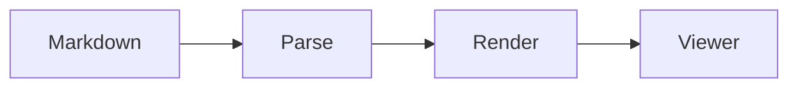

<!-- markdownlint-disable MD025 MD033 -->

# Markdown

Tanit renders Markdown files locally, without uploading the document or its
local assets. In addition to standard Markdown and GitHub Flavored Markdown,
the viewer supports document metadata, a table of contents, diagrams, math,
citations, callouts, image profiles, lightboxes, and embedded video.

Relative image and video paths are resolved from the folder containing the
Markdown file. Absolute `https://` URLs work directly. For web-hosted Markdown,
relative media URLs are resolved against the document's web base URL. The same
`pm-*` image and video attributes apply in tagged pages and other in-app
Markdown (posts, comments, page widgets). Those surfaces use the HTML player;
native mpv open and `${KNOWNFOLDER:…}` expansion need the file viewer.

> Media playback still depends on codecs supported by the installed browser or
> WebView runtime. An attribute such as `pm-format="webm"` describes the media;
> it does not convert the source file.

---

## Standard Markdown

### Headings

```markdown
# Document title
## Section
### Subsection
```

Level 2–4 headings are collected into the document table of contents.

Add a stable ID when another link must keep working after the heading text
changes:

```markdown
## Installation {#installation}

Jump to [installation](#installation).
```

Without an explicit ID, Tanit generates one from the heading text.

### Text formatting

```markdown
**bold**
*italic*
~~strikethrough~~
`inline code`

> A block quote.

---
```

### Links

```markdown
[Another section](#installation)
[A file beside this document](./manual.pdf)
[The Tanit website](https://example.com/)
<https://example.com/>
```

Relative links use the Markdown document's folder or web base URL. External
web links open through the system browser integration.

### Lists

```markdown
- First item
- Second item
  - Nested item

1. First step
2. Second step
```

Task lists are supported:

```markdown
- [x] Record the demo
- [ ] Add captions
- [ ] Publish
```

### Tables

```markdown
| Format | Use |
| --- | --- |
| PNG | Lossless image |
| WebP | Compact web image |
| MP4 | Common video container |
```

Wide tables scroll horizontally.

### Footnotes

```markdown
This statement has a footnote.[^source]

[^source]: Source details or a URL.
```

### Escaping Markdown

Use a backslash to show a Markdown control character literally:

```markdown
\*not italic\*
\# not a heading
```

---

## Document metadata

Place YAML frontmatter at the beginning of the file:

```yaml
---
title: Field notes
subtitle: September survey
description: Observations and measurements from the site.
author: Ada Example
authors: [Ada Example, Lin Example]
date: 2026-09-19
modified: 2026-09-20
tags: [research, fieldwork]
language: en
status: draft
template: report
toc: true
bibliography: references.bib
permissions: internal
---
```

Tanit displays the title, subtitle, description, author or authors, date, tags,
language, status, template, modified date, bibliography, and permissions.

Set `toc: false` to hide the table of contents. A table of contents is shown
only when the document has level 2–4 headings.

---

## Code

Indented code and fenced code blocks are supported:

````markdown
```typescript
const answer: number = 42;
```
````

Syntax highlighting is available for common C/C++, JavaScript, TypeScript,
JSON, Bash/shell, CSS, HTML/XML, Python, and Rust fences. Code blocks also
provide actions for copying, staging in the console, and sending code to Chat.

---

## Mermaid diagrams

Use `mermaid` or `mmd`:

````markdown

````

Sequence diagrams, state diagrams, class diagrams, and other diagram types
supported by the bundled Mermaid version can use the same fence.

---

## XBlox documents

Embed an XBlox flow with an `xblox` or `xblox-json` fence:

````markdown
```xblox
{
  "document": {
    "context": {},
    "roots": [
      {
        "kind": "stdout",
        "message": "Hello from Markdown"
      }
    ],
    "version": 1
  },
  "options": {
    "editable": false
  }
}
```
````

The block is rendered by Tanit's XBlox viewer. XBlox availability and actions
can depend on the installed edition and policy.

---

## Math and chemistry

Inline math uses one dollar sign:

```markdown
Einstein's relation is $E = mc^2$.
```

Display math uses two:

```markdown
$$
\int_0^\infty e^{-x^2}\,dx = \frac{\sqrt{\pi}}{2}
$$
```

A fenced `math` block is also supported:

````markdown
```math
\sum_{i=1}^{n} i = \frac{n(n+1)}{2}
```
````

KaTeX syntax is used. Chemistry expressions can use `\ce{...}` where
supported by the bundled KaTeX extensions:

```markdown
$\ce{H2O + CO2 -> H2CO3}$
```

---

## Citations

Tanit recognizes citation references in text:

```markdown
The result was reproduced later [@smith2025].
See the detailed derivation [@smith2025, pp. 17–19].
Suppress the author marker with [-@smith2025].
```

Citation keys may contain letters, numbers, `_`, `-`, `.`, `:`, and `@`.
The viewer preserves the key and optional page text as structured citation
metadata. It does not fetch a bibliography or format a reference list.

---

## Callouts and scientific blocks

Container directives render structured callout boxes:

```markdown
:::note
This is useful context.
:::

:::warning{title="Check the source"}
This operation replaces the destination file.
:::
```

Supported directive names:

- `note`
- `tip`
- `warning`
- `danger`
- `definition`
- `theorem`
- `proof`
- `example`
- `experiment`
- `exercise`
- `question`
- `answer`
- `citation`

Example:

```markdown
:::theorem{title="Pythagorean theorem"}
For a right triangle, $a^2 + b^2 = c^2$.
:::

:::proof
Construct similar triangles and compare their corresponding sides.
:::
```

Unknown directives are not promoted to custom components.

---

## Raw HTML

Benign inline HTML can be used when Markdown has no equivalent:

```html
Text with <kbd>Ctrl</kbd> + <kbd>S</kbd>.
```

HTML is sanitized. Scripts, event handlers, unsafe URLs, and unsupported
elements or attributes are removed. Do not rely on raw HTML for executable
content.

---

## Images

### Basic images

Use a local path relative to the Markdown file:

```markdown


```

Or use a web URL:

```markdown

```

Clicking an image opens the built-in lightbox. Press `Escape`, click the
backdrop, or use the close button to leave it. The expand button enters native
monitor fullscreen rather than browser-element fullscreen.

Enter native fullscreen immediately when the image is opened:

```markdown
{pm-fullscreen="immersive"}
```

Add a caption with the standard image title:

```markdown

```

Translate the caption with `pm-caption_<lang>`. The title is the default
(usually English). Display language selects a matching variant (`de`,
`de-DE` → `de`). `pm-caption-de` is the same attribute. `pm-caption` replaces
the title for every language that has no variant.

```markdown
{
  pm-media="video"
  pm-caption_de="Einfuehrung"
}
```

| Attribute | Purpose |
| --- | --- |
| `"title"` | Default caption |
| `pm-caption` | Default caption, overrides the title |
| `pm-caption_de` / `pm-caption-de` | Caption for German |
| `pm-caption_en` / `pm-caption-en` | Caption for English |

Switching Settings display language updates the caption without editing the
document.

### Image profiles

Tanit extends image Markdown with a `{pm-*}` attribute block immediately after
the image:

```markdown
{pm-inline="1280 webp" pm-lightbox="original"}
```

The supported image attributes are:

| Attribute | Purpose | Examples |
| --- | --- | --- |
| `pm-inline` | Inline display target | `"1280"`, `"1280 webp"`, `"original"` |
| `pm-lightbox` | Lightbox target | `"2048"`, `"2048 avif"`, `"original"` |
| `pm-profile` | Apply one target to inline and lightbox | `"1600 webp"` |
| `pm-width` | Direct maximum display width | `"1280"` |
| `pm-class` | Add safe predefined CSS class names | `"hero-image rounded"` |
| `pm-media` | Explicit media kind | `"image"`, `"animated-webp"`, `"video"` |
| `pm-fit` | Object fit | `"contain"`, `"cover"` |
| `pm-fullscreen` | Native lightbox fullscreen | `"none"`, `"frame"`, `"immersive"`, `"full"` |
| `pm-caption` | Default caption (overrides the title) | `"Main dashboard"` |
| `pm-caption_<lang>` | Localized caption | `pm-caption_de="Uebersicht"` |

Target values accept compact or key/value syntax:

```markdown
{pm-inline="960 webp"}
{pm-inline="width=960 format=webp"}
{pm-profile="original"}
```

Supported image format hints are `avif`, `webp`, `png`, and `jpeg`. In the
local viewer, width controls the displayed maximum width and `original`
removes that profile limit. Format values are compatibility hints for
publishing pipelines; the viewer does not transcode a local file.

`pm-class` accepts space-separated class names containing letters, numbers,
`_`, and `-`. Arbitrary HTML or style text is rejected.

### Animated WebP

An animated WebP is displayed as an image and retains browser-native animation:

```markdown
{pm-media="animated-webp" pm-fit="contain" pm-width="960"}
```

---

## Videos

Video uses standard image syntax plus `pm-media="video"`:

```markdown
{pm-media="video"}
```

Common video extensions (`.mp4`, `.webm`, `.ogg`, `.mov`, `.mkv`, and
`.m3u8`) are also recognized as video automatically, but the explicit
attribute is recommended.

### Local and web video

Local file beside the Markdown document:

```markdown
{pm-media="video"}
```

HTTPS source:

```markdown
{pm-media="video"}
```

Relative source in web-hosted Markdown:

```markdown
{pm-media="video"}
```

For local documents, keep assets in the Markdown folder or its subfolders.
Raw Windows paths such as `C:\Videos\demo.mp4` are not portable Markdown URLs.

### Start at a timestamp

Append a W3C media fragment to the source path to open at a time, or between
two times. Tanit maps `#t=` to the native player (`start` / `end`) and the
HTML player seeks after metadata loads.

```markdown
{pm-media="video"}
{pm-media="video" pm-controls="false"}
[Jump to 90s](./walkthrough.mp4#t=90)
```

Accepted forms: `#t=90`, `#t=90.5`, `#t=1:30`, `#t=01:02:03`, `#t=90,120`,
`#t=,120`. Do not put mpv-only forms (`50%`, `#2`, `-56`) in the Markdown URL.

### Subtitles

Native playback (mpv) uses the app display language as `--slang` and loads
matching sidecar files next to the video. `sub-auto` defaults to `exact`
(stock mpv): `demo.de.srt` matches `demo.mp4`. Tanit also attaches the
underscore form `demo_de.srt` for the UI language, so a German UI opens
English `test.mp4` with `test_de.srt` on.

```markdown
{pm-media="video" pm-player="native"}
{pm-media="video" pm-slang="de" pm-sub-auto="fuzzy"}
{pm-media="video" pm-sub="off"}
{pm-media="video" pm-sub-file="./notes.srt"}
```

| Attribute | Values | Default |
| --- | --- | --- |
| `pm-sub` / `pm-subs` | `auto`, `on`, `off` | `auto` (load + pick by language) |
| `pm-slang` | `app`, `none`, `de`, `de,en` | `app` (Settings display language) |
| `pm-sub-auto` | `no`, `exact`, `fuzzy`, `all` | `exact` |
| `pm-sub-file` | Sidecar path | Also try `stem.lang.srt` and `stem_lang.srt` |

`pm-slang="none"` clears the preferred list and lets mpv use the OS language.
`pm-sub-auto="fuzzy"` loads any sidecar whose name contains the video stem
(`test_de.srt`, `test.forced.de.srt`). `pm-sub="off"` disables autoload and
leaves captions off.

The HTML video viewer probes the same sibling names and prefers a track that
matches the display language.

### Native video

The default renderer shows HTML controls and a corner fullscreen control:

```markdown
{
  pm-media="video"
  pm-renderer="native"
  pm-width="1280"
  pm-fit="contain"
  pm-preload="metadata"
}
```

Attribute blocks can be written on one line when maximum Markdown portability
is needed:

```markdown
{pm-media="video" pm-renderer="native" pm-width="1280" pm-fit="contain" pm-preload="metadata"}
```

The fullscreen control defaults to `pm-player="native"` (Tanit's dedicated
player). Use `pm-player="web"` for the HTML lightbox instead:

```markdown
{pm-media="video" pm-player="native"}
{pm-media="video" pm-player="web"}
```

HTTPS video URLs also use the native player by default. Use
`pm-player="web"` when browser cookies, DRM, or browser-only playback behavior
is required. The Markdown title is the default caption below the video;
`pm-caption_<lang>` selects a translation from the display language.

### Large play overlay

`pm-controls="false"` hides HTML chrome and places a large play button over
the media. The video (or `pm-poster`) stays in the page, dimmed, so the first
frame is visible. Play-cover preload defaults to `auto`; set `pm-preload`
explicitly to change that.

```markdown
{
  pm-media="video"
  pm-controls="false"
  pm-open="lightbox"
  pm-player="native"
  pm-fullscreen="immersive"
  pm-autoplay="true"
  pm-width="800"
  pm-fit="contain"
  pm-preload="auto"
}
```

These options compose independently:

| Concern | Attributes | Default |
| --- | --- | --- |
| Chrome | `pm-controls` | HTML controls on; `false` = large play overlay |
| Preview under the overlay | `pm-preload`, `pm-poster`, `pm-fit` | `auto` on a play overlay; poster until a frame is ready |
| Dim amount | `pm-overlay` | `medium` (`light` / `dark` / `none`) |
| Where click plays | `pm-player`, `pm-open`, `pm-fullscreen` | Overlay click plays **inline** unless `pm-open` is `lightbox` / `viewer` or `pm-fullscreen` is not `none` |
| Play on that click | `pm-autoplay` | Native/lightbox click plays unless `false` |

Ambient looping video is unchanged: `pm-controls="false"` plus inline
`pm-autoplay` (and no lightbox/fullscreen destination) plays in the page
without a play overlay.

`pm-open="viewer"` sends the file to the centre viewer. `pm-fullscreen`
chooses chrome (`none` = in-frame overlay, `frame` / `immersive` / `full` =
monitor cover). On a play overlay that already opens native, the corner
fullscreen button is omitted. Pause on an inline overlay (click the video)
returns the dimmed play button over the frozen frame.

### Video card

`video-card` uses the same large play overlay, then starts the HTML player
with controls. `pm-poster` and `pm-preload` decide what sits under the
button before click:

```markdown
{
  pm-media="video"
  pm-renderer="video-card"
  pm-poster="./tour-poster.jpg"
  pm-width="1280"
}
```

Single-line equivalent:

```markdown
{pm-media="video" pm-renderer="video-card" pm-poster="./tour-poster.jpg" pm-width="1280"}
```

### Responsive mobile source

Provide a smaller or portrait source below 768 px:

```markdown
{
  pm-media="video"
  pm-mobile-src="./campaign-portrait.mp4"
  pm-poster="./campaign-cover.jpg"
}
```

Both paths can also be HTTPS URLs.

### Autoplay, loop, mute, and controls

```markdown
{
  pm-media="video"
  pm-autoplay="true"
  pm-muted="true"
  pm-loop="true"
  pm-controls="false"
  pm-preload="auto"
}
```

Browsers generally require autoplay video to be muted. Tanit therefore mutes
autoplay media by default unless playback policy permits otherwise.

Play only while the video is in view:

```markdown
{pm-media="video" pm-autoplay="inview" pm-muted="true" pm-loop="true"}
```

Accepted boolean values are `true`/`false`, `1`/`0`, `yes`/`no`, and
`on`/`off`.

### Video banners

An inline banner places its heading and description over the video:

```markdown
{
  pm-media="video"
  pm-mode="banner"
  pm-poster="./hero.jpg"
  pm-overlay="dark"
  pm-min-height="520"
  pm-autoplay="inview"
  pm-muted="true"
  pm-loop="true"
  pm-play-toggle="true"
}
```

`banner-full` keeps the title and caption in a separate panel:

```markdown
{
  pm-media="video"
  pm-mode="banner-full"
  pm-poster="./release.jpg"
  pm-min-height="480"
  pm-controls="false"
}
```

Overlay values are `light`, `medium`, `dark`, and `none`.

### Complete video attribute reference

| Attribute | Values | Default / behavior |
| --- | --- | --- |
| `pm-media` | `video` | Selects video rendering |
| `pm-renderer` | `native`, `video-card` | `native` |
| `pm-format` | `original`, `mp4`, `webm`, `hls` | Source/container hint; no conversion |
| `pm-width` | Positive pixel width | Maximum displayed width |
| `pm-preset` | Safe preset name | Reserved metadata for compatible publishers |
| `pm-poster` | Image path or URL | Poster/cover image |
| `pm-mobile-src` | Video path or URL | Used below 768 px |
| `pm-fit` | `contain`, `cover` | `cover` for banners; otherwise player styling |
| `pm-autoplay` | Boolean or `inview` | Off for inline HTML; on a destination overlay, click plays unless `false` |
| `pm-muted` | Boolean | On when autoplay is enabled |
| `pm-loop` | Boolean | Off |
| `pm-controls` | Boolean | On except banners; `false` shows a large play overlay (not ambient autoplay) |
| `pm-open` | `default`, `viewer`, `lightbox`, `browser` | Destination for the overlay click / media link |
| `pm-fullscreen` | `none`, `frame`, `immersive`, `full` | Native chrome when opening mpv or a lightbox |
| `pm-mode` | `inline`, `banner`, `banner-full` | `inline` |
| `pm-overlay` | `light`, `medium`, `dark`, `none` | `medium` on banners and play overlays |
| `pm-min-height` | Positive pixel height | `500` for banners |
| `pm-preload` | `none`, `metadata`, `auto` | `metadata`; `auto` on a play overlay; `none` for in-view autoplay |
| `pm-play-toggle` | Boolean | Adds a banner play/pause control |
| `pm-player` / `player` | `native`, `web` | Fullscreen player; defaults to `native` |
| `pm-sub` / `pm-subs` | `auto`, `on`, `off` | `auto`: load sidecars and pick by `pm-slang` |
| `pm-slang` | `app`, `none`, language list | Preferred subtitle language; `app` = display language |
| `pm-sub-auto` | `no`, `exact`, `fuzzy`, `all` | Sidecar name match; `exact` plus `stem_lang.srt` |
| `pm-sub-file` | Sidecar path | Explicit subtitle file |
| `pm-caption` | Default caption | Overrides the Markdown title |
| `pm-caption_<lang>` | Localized caption | `pm-caption_de`, `pm-caption-de`; title is the fallback |
| `pm-class` | Safe class names | Added to the media container |

The original example is valid:

```markdown
{pm-media="video" pm-renderer="video-card" pm-format="webm" pm-width="1280"}
```

Because the source above is named `.mp4`, the player uses its actual MP4
container. `pm-format="webm"` does not rename or transcode it; use a `.webm`
source when WebM is required.

---

## Media links

A normal link to a recognized local media file opens that file in Tanit's
dedicated viewer:

```markdown
[Open the demo video](./home/demo.mp4)
[Open the soundtrack](./audio/theme.flac)
[Open the full-resolution image](./images/poster.png)
[Open the report](./reports/results.pdf)
```

The path is resolved relative to the Markdown document before it is sent to
the native viewer. Image, video, audio, and PDF extensions are recognized.

`${VAR}` templates use the same expansion as custom commands
(`command_variables.cpp`). The host expands them with the current document
as `${CURRENT_FILE}` before opening native playback:

```markdown
[Play a recording](${KNOWNFOLDER:Videos}/screen-recordings/demo.mp4){
  pm-open="lightbox"
  pm-player="native"
  pm-fullscreen="full"
}
{pm-media="video" pm-controls="false"}
{pm-media="video"}
```

`KNOWNFOLDER`, `USER:`, `TANIT_ROOT` / `tanit`, `TANIT_SHARED`, dates, and
path functions work. Unresolved tokens stay closed (the link does not open a
literal `${…}` path). Variable sources always use the native player; the HTML
viewer cannot expand OS folders.

Use `pm-open="lightbox"` to keep the document open and display an image or
video over it:

```markdown
[Preview the poster](./images/poster.png){pm-open="lightbox"}
[Play the clip](./home/demo.mp4){pm-open="lightbox"}
[Play the remote clip](https://cdn.example.com/demo.webm){pm-open="lightbox"}
[Play native fullscreen](./home/demo.mp4){pm-open="lightbox" pm-player="native" pm-fullscreen="full"}
[Play web fullscreen](./home/demo.mp4){pm-open="lightbox" pm-player="web" pm-fullscreen="full"}
```

Press `Escape`, click the backdrop, or use the close button to close the
lightbox. Video lightboxes use native playback controls and start playing after
the user activates the link. The expand button enters real native fullscreen
and covers the monitor. This is separate from browser-element fullscreen,
which remains constrained to the WebView. Local videos default to the native
player; `pm-player="web"` explicitly requests this HTML lightbox.

`pm-fullscreen="frame"` uses F11-style native fullscreen while retaining the
configured viewer chrome. `pm-fullscreen="immersive"` also hides docks,
toolbars, the filmstrip, and other viewer chrome. Closing a lightbox that
started fullscreen restores the windowed app. `pm-fullscreen="full"` is the
media-first alias for immersive mode: it also removes lightbox padding and
expands the image or video to the entire available screen with `object-contain`.

For a URL without a recognizable extension, declare its type:

```markdown
[Preview generated image](https://cdn.example.com/media/42){pm-open="lightbox" pm-viewer="image"}
[Play streamed video](https://cdn.example.com/media/84){pm-open="lightbox" pm-viewer="video"}
```

Supported link attributes:

| Attribute | Values | Behavior |
| --- | --- | --- |
| `pm-open` | `default`, `viewer`, `lightbox`, `browser` | Selects the destination |
| `pm-viewer` | `image`, `video`, `audio`, `pdf` | Declares the media type |
| `pm-fullscreen` | `none`, `frame`, `immersive`, `full` | Starts native fullscreen after opening; `full` also fills the lightbox |
| `pm-player` / `player` | `native`, `web` | Selects native dedicated playback or the HTML lightbox; defaults to `native` |
| `pm-sub` / `pm-slang` / `pm-sub-auto` / `pm-sub-file` | Same as embedded video | Passed through when the link opens native mpv |
| `pm-caption` / `pm-caption_<lang>` | Same as embedded video | Localized link title / tooltip |

`default` automatically opens recognized local media in the dedicated viewer.
Recognized HTTPS video URLs use native mpv playback by default; remote images
and other HTTP(S) links open in the system browser. `viewer` explicitly
requests the dedicated viewer, while `pm-player="web"` keeps a video in the
HTML lightbox. Use `browser` for an HTTP(S) link that must always leave the
embedded viewer.

---

## Path and URL rules

| Source | Resolution |
| --- | --- |
| `./image.png` | Relative to the Markdown file or web document |
| `assets/image.png` | Relative to the Markdown file or web document |
| `https://…` | Loaded directly |
| `data:image/…` | Allowed for inline images |
| `${KNOWNFOLDER:Videos}/clip.mp4` | Expanded by command variables, then opened natively |
| `${USER:name}/clip.mp4` | User setting from Settings → Variables |
| `${PATH_DIR:CURRENT_FILE}/assets/a.mp4` | Folder of the Markdown document |
| `tanit://…` | Sent to Tanit's registered native protocol handler |
| `C:\…` | Not portable; prefer `${KNOWNFOLDER:…}` or a relative path |

Use protocol links to open app resources, VFS files, folders, or commands:

```markdown
[Open a local report](tanit://view/C:/Users/alice/report.md)
[Open a VFS model](tanit://view/vfs/models/test/3d.scad)
[Browse a project](tanit://browse/C:/Projects)
[Pause the batch](tanit://app/pausebatch)
```

Protocol links are preserved by the Markdown sanitizer and activated through
the native host instead of navigating the WebView. The `tanit://` handler must
be registered. Existing protocol validation, policy checks, and consent apply
before Tanit acts on the URI.

Local assets are exposed to the embedded viewer through a private virtual
HTTPS host. This avoids blocked `file://` access while keeping the files on the
machine.

Prefer HTTPS for remote media. An HTTP asset embedded in the HTTPS viewer may
be rejected as mixed content by the browser runtime.

---

## Compatibility notes

- The Markdown source remains readable in ordinary Markdown tools. Tools that
  do not know `pm-*` attributes may display the trailing attribute text.
- Image and media profiles control presentation; they do not modify source
  files.
- Video codec support comes from the browser/WebView runtime.
- HLS (`.m3u8`) support varies by platform and runtime.
- Autoplay can be blocked by browser policy.
- Raw HTML is sanitized and cannot run scripts.


## References

- [Tanit App-Commands](https://tanit.polymech.info/user/cgo/tanit-app-commands)

- [Tanit UI Launch Args](https://tanit.polymech.info/user/cgo/tanit-ui)


