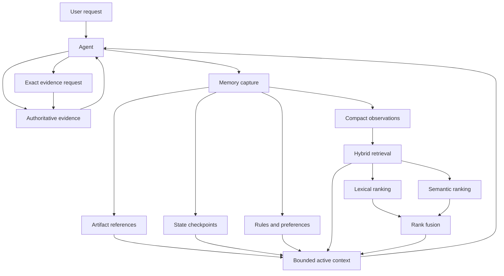
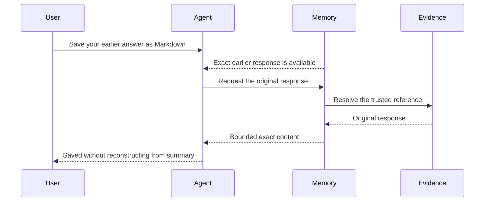
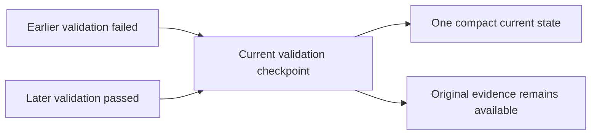
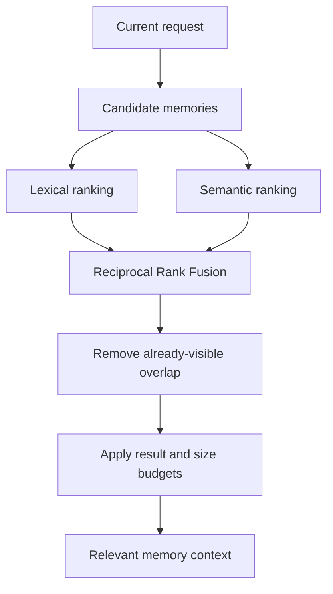
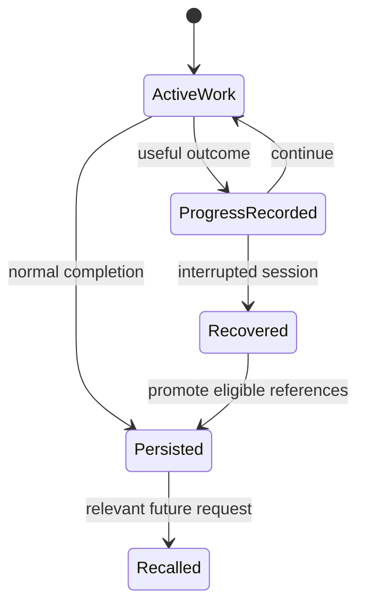

<!-- markdownlint-disable MD025 -->

# Agent Memory: durable continuity without replaying everything

Tanit Agent Memory helps the assistant continue from earlier work without
placing an entire conversation into every model request. Compact memory
describes what may matter; authoritative evidence remains available for exact
recovery; recent and relevant context stays within budgets; sensitive tool
output remains under security policy.

This is not model training. Continuity, persistence, retrieval, and permission
stay controlled by Tanit around the selected model.

> Available features can vary by edition and organization policy.

---

## What you should notice

- Short follow-ups can refer to “that result” without another full briefing.
- Earlier long answers and eligible tool results can be recovered exactly.
- Similar past answers stay distinguishable.
- Relevant context can cross session boundaries.
- Completed setup work and validation state do not need rediscovery every turn.
- Stale derived memory ages out instead of accumulating forever.

Memory does not mean every old detail is always shown. It means the right detail
can be found when needed.

---

## Problem and solution

| Problem | Tanit approach |
| :-- | :-- |
| Full-history replay is expensive and noisy | Inject bounded context, not complete transcripts |
| Summaries omit exact wording | Preserve evidence and recover originals on demand |
| Tool responses are large | Keep compact observations with evidence references |
| Setup work is repeated | Retain replaceable state checkpoints |
| Keyword search misses paraphrases | Combine lexical and semantic retrieval |
| Semantic search misses identifiers | Keep exact-term ranking and fuse results |
| Similar past answers are confused | Stable identities plus exact evidence references |
| Old derived memory accumulates | Bounded retention, replacement, and eviction |
| Tool memory could expose secrets | Filter sensitive classes and enforce scope |

---

## Architecture

Tanit separates evidence, compact memory, retrieval, and the active prompt.
Those layers have different responsibilities and retention policies.



Three representations keep the system honest:

| Layer | Role |
| :-- | :-- |
| **Evidence** | Original assistant replies and eligible tool results |
| **Observation** | Compact, searchable description of what happened |
| **Reusable state** | Current checkpoints, artifact references, rules |

The evidence store is not the prompt. A summary is never treated as an exact
copy. When a summary and original evidence differ, the evidence wins.

### Shapes in practice

Session memory stores compact items—not transcript dumps. Every item shares a
common envelope:

```ts
type SessionMemoryItem = {
  id: string                 // stable item id, e.g. turn_ab12
  kind: string               // conversation | document | tool_observation | tool_checkpoint | …
  role: string               // turn_pair | markdown | validation | search_results | …
  summary: string            // short searchable description
  created_at: string
  last_used_at: string       // used for recency / eviction
  use_count: number
  origin?: { type: string; tool_name?: string; server_name?: string }
  locator?: { path?: string } // filesystem reference when applicable
  status?: "ok" | "failed"
  metadata?: Record<string, unknown>
}
```

A conversation turn records the compact exchange and whether the original
assistant body can still be materialised:

```json
{
  "id": "turn_a7f3",
  "kind": "conversation",
  "role": "turn_pair",
  "summary": "user: export the gallery report · assistant: wrote gallery.md (tools: write_file, run)",
  "metadata": {
    "user": "export the gallery report",
    "assistant": "Wrote gallery.md with 12 entries…",
    "assistant_chars": 4821,
    "tools": ["write_file", "run"],
    "tool_calls": [
      {
        "tool": "run",
        "call_id": "call_9c2e",
        "ok": true,
        "command": "npm test",
        "payload_available": true
      }
    ],
    "body_available": true,
    "source_log": {
      "session_id": "chat-42",
      "log_id": "run-018e"
    }
  }
}
```

A replaceable checkpoint keeps only the latest install, build, or validation
outcome, with a pointer back to the canonical tool result:

```json
{
  "id": "checkpoint_run_test",
  "kind": "tool_checkpoint",
  "role": "validation",
  "status": "ok",
  "summary": "Last npm test checkpoint: passed (exit 0)",
  "origin": { "type": "tool", "tool_name": "run" },
  "metadata": {
    "checkpoint": "test",
    "command": "npm test",
    "exit_code": 0,
    "transcript_tool_call_id": "call_9c2e",
    "payload_available": true,
    "source_log": {
      "session_id": "chat-42",
      "log_id": "run-018e"
    }
  }
}
```

An artifact remembers a produced file by reference:

```json
{
  "id": "art_gallery_md",
  "kind": "document",
  "role": "markdown",
  "summary": "Markdown gallery listing with 12 entries",
  "locator": { "path": "work/gallery.md" },
  "origin": { "type": "tool", "tool_name": "write_file" },
  "metadata": {
    "content_type": "text/markdown",
    "source": "written_by_tool",
    "size_bytes": 18442
  }
}
```

A tool observation keeps a searchable summary of an external or MCP result
without copying the full payload into the prompt:

```json
{
  "id": "obs_search_web_3f91",
  "kind": "tool_observation",
  "role": "search_results",
  "status": "ok",
  "summary": "Search returned 5 sources about directory gallery CLIs",
  "origin": {
    "type": "mcp",
    "server_name": "research",
    "tool_name": "search"
  },
  "metadata": {
    "transcript_tool_call_id": "call_44aa",
    "payload_available": true,
    "payload_denied": false,
    "raw_chars": 12840,
    "source_log": {
      "session_id": "chat-42",
      "log_id": "run-018e"
    }
  }
}
```

Exact recovery is an explicit `memory_find` call against those identities:

```json
// recover an earlier assistant reply
{ "itemId": "turn_a7f3", "includeBody": true, "maxBytes": 65536 }

// recover the same-session npm test payload via its checkpoint
{ "itemId": "checkpoint_run_test", "includePayload": true }

// ranked search across past chats
{
  "query": "final gallery HTML output path",
  "searchPastChats": true,
  "includeArtifacts": true,
  "maxResults": 8
}
```

Hybrid recall ranks candidates from `search_text` (paths, roles, summaries,
identifiers) with lexical and optional dense scores, then fuses ranks:

```ts
type MemoryRecallCandidate = {
  session_id: string
  item_id: string
  search_text: string   // normalized lexical field for BM25
  summary: string
  inject_line: string   // compact line considered for prompt injection
  item: SessionMemoryItem
}

// Reciprocal Rank Fusion over independent result lists
// RRF(candidate) = Σ 1 / (k + rank_i)
```

Only selected inject lines enter the next prompt. Bodies and tool payloads stay
behind `body_available` / `payload_available` until requested.

---

## Exact recovery

Long answers and tool results stay outside compact prompt memory. A small
record indicates that the original remains available. When a later request needs
exact content, Tanit resolves the trusted `source_log` reference and returns a
bounded portion. Larger results can be recovered in additional portions.



Exact tool-result recovery is stricter than ordinary memory search: it must
resolve to trusted evidence, remain inside session and security policy, and fail
closed when evidence is missing or out of scope. Sensitive classes such as
credentials, tokens, and consent decisions are excluded.

Recovery can only return what Tanit actually recorded. If an upstream service
shortened a response before it arrived, memory cannot recreate missing data.

---

## Checkpoints and artifacts

Follow-up work often needs current state, not a full historical log. Compact
install, build, and validation checkpoints keep the latest outcome. A newer
result replaces the previous compact state; the original evidence remains
available when exact detail is required.



When tools create useful files, Tanit remembers references—location, type,
role, producing tool, and a short description—rather than copying whole files
into memory. The filesystem remains authoritative if a referenced file changes
or disappears.

Rules and preferences stay separate from episodic observations, so a formatting
preference is not confused with a past tool result. Compact reflections from
failed attempts can note what went wrong without replaying the whole trajectory.

---

## Hybrid retrieval

No single ranking method covers every memory question.

- **Lexical ranking** finds paths, package names, symbols, error codes, URLs,
  and exact phrases.
- **Semantic ranking** finds paraphrased intent (“release checklist” vs “steps
  before publishing”).
- **Reciprocal Rank Fusion** combines both rankings without forcing their scores
  onto one scale.



Semantic retrieval is optional. Exact-term search remains useful when
identifiers matter more than meaning.

---

## How recall works

**Automatic recall** prepares a small relevant-memory section for natural
continuity. It is bounded, overlap-aware, and does not block a response if
recall is unavailable.

**Explicit recall** lets the assistant search memory and request exact evidence
when the task clearly depends on earlier work—exporting an answer, recovering a
tool result, or distinguishing similar drafts.

Users do not need memory jargon. Phrases such as “use your exact previous
response,” “continue from the earlier result,” or “use the source list you
found” are enough. Remembering that a tool was used does not grant permission
to use it again.

Current-session memory connects results to their next step. Cross-session
search ranks compact memory from earlier conversations; exact recovery follows
the selected evidence reference, with tool evidence under stricter boundaries.

---

## Durability

Eligible outcomes, artifacts, rules, and continuity references persist after a
completed turn. Important tool outcomes can also be recorded while work is in
progress, so interrupted sessions can still recover useful artifacts. Named
snapshots preserve a session state deliberately.



Removing a derived memory item does not rewrite the historical evidence record.

---

## Security, budgets, and forgetting

Memory is not a security bypass.

- Exact recovery requires a valid reference and matching evidence.
- Sensitive result classes are filtered from general payload recovery.
- Tool-result recovery uses stricter session boundaries than ordinary search.
- New actions still evaluate workspace scope, consent, and security policy.
- Only selected active context is sent with a model request.

Derived memory stays removable: observations, rules, prompt context, recall
results, and search-index entries are bounded. Recent use can reinforce
relevance; replaceable checkpoints keep only the current compact state. When an
item is evicted, associated search entries leave with it so forgotten material
does not linger in a stale index.

Complete transcripts are not replayed by default. Large tool results appear as
availability hints until exact content is requested. Items already visible in
the prompt are not injected again.

---

## What Agent Memory is not

- Training or fine-tuning the selected model
- Unlimited transcript replay
- Unrestricted cross-session tool-output access
- Automatic reuse of permissions
- Proof that an old file reference is unchanged
- A replacement for current validation
- A guarantee that deleted evidence can be reconstructed

The focus stays on lower-risk primitives: evidence, observations, trusted
references, bounded retrieval, replacement, and eviction.

---

## Future direction

The architecture can grow toward contradiction handling, provenance-linked
knowledge, durable compaction, procedural memory, background consolidation,
learned retention, and clearer user-facing inspection. One rule remains:

> Derived knowledge may summarize evidence, but every important claim should
> retain a path back to the evidence that justified it.

---

## Research and further reading

These references provide background; they do not imply feature-for-feature
equivalence.

### Practical agent-memory architectures

- [jcode](https://github.com/1jehuang/jcode) — open coding-agent work on
  explicit and automatic memory, session search, and background processing
- [jcode Memory Architecture](https://github.com/1jehuang/jcode/blob/HEAD/docs/MEMORY_ARCHITECTURE.md)
- [jcode Ambient Mode](https://github.com/1jehuang/jcode/blob/HEAD/docs/AMBIENT_MODE.md)

### Foundational memory and reflection

- Park et al.,
  [Generative Agents](https://doi.org/10.1145/3586183.3606763), UIST 2023
- Shinn et al.,
  [Reflexion](https://proceedings.neurips.cc/paper_files/paper/2023/hash/1b44b878bb782e6954cd888628510e90-Abstract-Conference.html),
  NeurIPS 2023
- Packer et al.,
  [MemGPT](https://arxiv.org/abs/2310.08560), 2023

### Retrieval

- Cormack, Clarke, and Büttcher,
  [Reciprocal Rank Fusion](https://doi.org/10.1145/1571941.1572114), SIGIR 2009

### Long-term memory evaluation

- Wu et al.,
  [LongMemEval](https://proceedings.iclr.cc/paper_files/paper/2025/hash/d813d324dbf0598bbdc9c8e79740ed01-Abstract-Conference.html),
  ICLR 2025
- Gao et al.,
  [SWE-MeM](https://arxiv.org/abs/2606.28434), 2026 preprint
- [PRO-LONG](https://arxiv.org/abs/2607.20064), 2026 preprint

### Surveys

- [Memory for Autonomous LLM Agents](https://arxiv.org/abs/2603.07670), 2026
- [From Storage to Experience](https://arxiv.org/abs/2605.06716), 2026
- [AdMem](https://arxiv.org/abs/2606.06787), 2026 preprint

### Examples

- [Session Dump - Markdown / HTML Gallery](https://tanit.polymech.info/app/filebrowser/software/tanit/docs/llm?file=agent-coding-qualhtml-gallery-cli-test-run-ms8y6-harness-.html)
