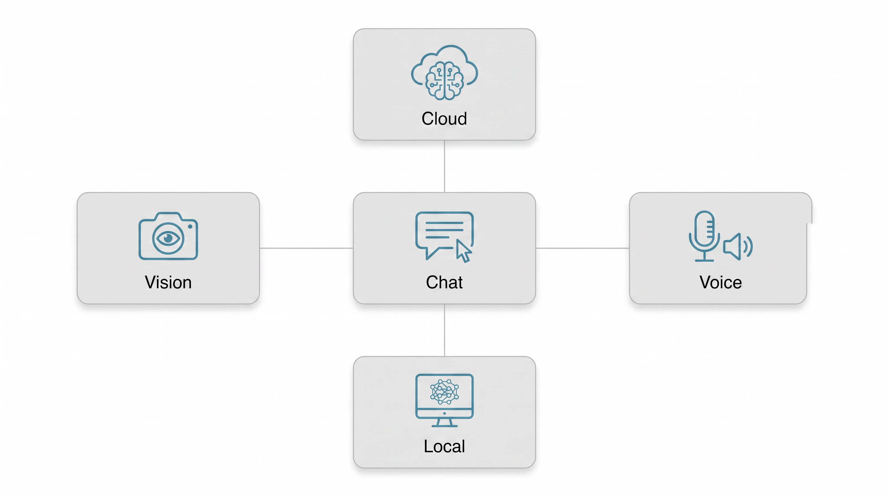
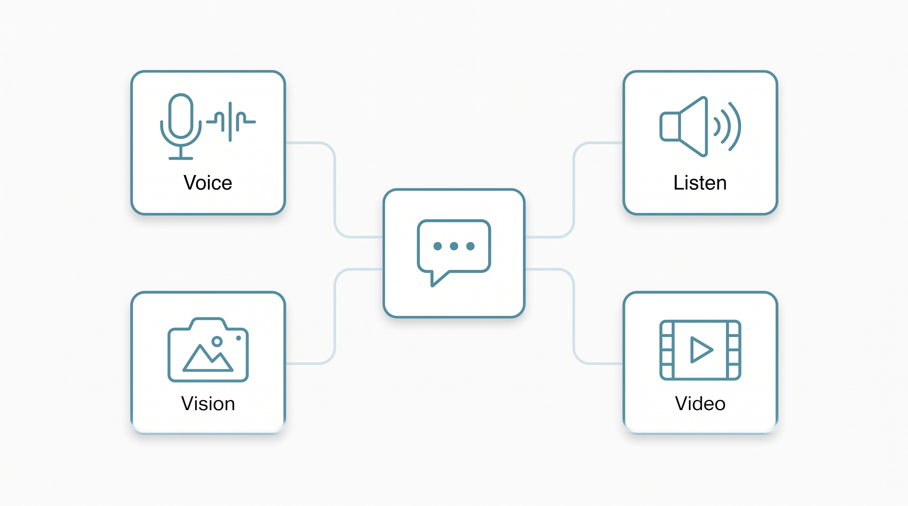
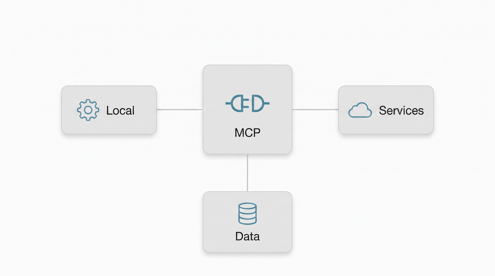
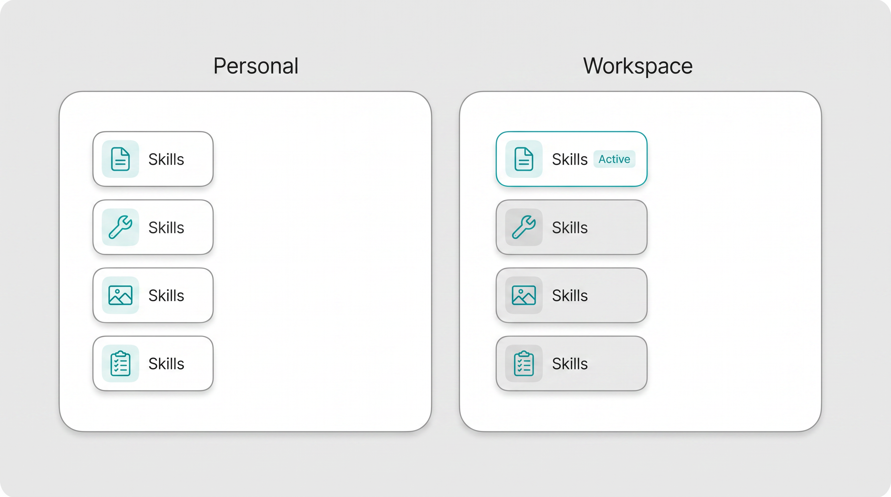

<!-- markdownlint-disable MD025 -->
# Chat settings

Tanit lets you choose how each part of chat works: the model that answers,
the planner that selects tools, the voice that speaks, and the permissions
that protect your files. Start with a preset, then change only what matters.

Settings shown in your edition may vary with installed features and
organization policy.

## Quick setup with presets

Chat presets keep a complete working configuration together. Select an
existing preset, name and create a new one, update it after making changes,
set the preferred default, or delete presets you no longer need.

Each preset can remember the agent runner, chat and media models, tools, MCP
availability, and skill policy. This makes a local-only setup, a fast everyday
assistant, and a tool-heavy research agent repeatable instead of fragile.

> **Screenshot placeholder:** Chat settings — preset selector and actions.

## Providers and accounts

Open **Settings → Providers** before selecting models. Providers can be direct
cloud services, compatible endpoints, aggregators, Tanit services, or local
runtimes.

- **Authentication mode** — use a provider API key, supported account login,
  or automatic credential selection.
- **API key** — bring your own key; reveal, copy, replace, or clear it locally.
- **Base URL** — point a provider at a compatible hosted, private, or local
  endpoint.
- **Enable provider** — keep unused providers out of model selectors.
- **Test connection** — verify credentials and model discovery before opening
  a chat.
- **Refresh models** — update model choices without restarting Tanit.

Provider credentials grant access to your account and should be handled like
passwords. Organization policy can limit which providers are available.

> **Screenshot placeholder:** Providers — authentication, API key, endpoint,
> enable switch, and connection test.

## Text chat, planning, and consent review

Open **Settings → Chat** to choose the main text path.

- **Agent runner** — selects the conversational or agent execution style saved
  with the preset.
- **Router / provider** — chooses where normal text requests are sent.
- **Model** — selects or enters the model identifier used for chat.
- **Maximum iterations** — limits how many model/tool cycles one agent turn may
  use. Lower values contain cost; higher values allow longer tasks.
- **Planner enabled** — lets a planning pass select a smaller, relevant tool
  set before execution.
- **Planner provider and model** — use a fast specialist model for planning, or
  inherit the main chat selection.
- **AI consent reviewer provider and model** — optionally use a separate model
  to review sensitive agent actions; it can inherit the planner selection.

### API mode and realtime chat

- **Completion** — traditional message completion for broad compatibility.
- **Responses** — provider-native response handling where supported.
- **Realtime** — low-latency interactive conversation with its own provider,
  model, and voice selection.

Realtime controls appear only when the feature and chosen provider support
them.

> **Screenshot placeholder:** Chat — text, planner, consent reviewer, and API
> mode panels.

## Images, vision, video, and OCR

Media tasks can use different providers and models from text chat. This lets
you pair a small local text model with a capable vision model, or keep private
images entirely on the machine.

- **Image generation provider and model** — creates or edits images. Replicate
  users can also select a model collection.
- **Image recognition provider and model** — understands attached, selected,
  pasted, or captured images.
- **Video provider and model** — creates video with a dedicated local or cloud
  model where available.
- **OCR provider and model** — extracts text from screenshots, scans, and image
  files; the model choice appears when the selected OCR path requires one.
- **Refresh** — reloads the available models for each media role.

> **Screenshot placeholder:** Chat — image generation, vision, video, and OCR
> provider/model selectors.

## Voice and capture devices

Chat voice has two independent model paths and a separate device page.

### Voice models

- **Speech-to-text provider and model** — converts microphone input or audio
  files into text; local Whisper-based and external options may be available.
- **Text-to-speech provider and model** — reads responses aloud or creates
  audio output.
- **Voice** — selects a provider voice where supported.
- **VibeVoice model, tokenizer, and voice** — configures the dedicated local
  VibeVoice path when selected.
- **Realtime voice** — selects the live conversation voice independently from
  normal text-to-speech.

### Audio and video devices

Open **Settings → Audio & Video** to choose:

- **Audio input device** and **audio output device**.
- **Input source** — microphone, desktop audio, or a mix.
- **Desktop audio device**, **microphone gain**, and **desktop gain**.
- **Video capture device** for camera and capture workflows.
- **Missing-device policy** — fall back to an available device or fail clearly.
- **Refresh devices** — rescan after connecting or removing hardware.
- **Voice commands** — always-listening command center (wake phrase, listen
  microphone, Whisper backend). This is not chat realtime voice. See
  [Voice Commands](tanit-commands#voice-commands).

> **Screenshot placeholder:** Audio & Video — input/output devices, sources,
> gain controls, camera, and missing-device policy.

## Memory and sessions

Memory recall brings relevant context from earlier chats into a new turn
without replaying every transcript.

- **Hybrid profile** — combines exact-term and semantic matching, then injects
  the best context.
- **Lexical profile** — uses exact-term matching only.
- **Shadow profile** — evaluates recall without adding it to the prompt.
- **Off** — disables automatic recall.
- **Richness** — chooses concise, balanced, or rich context injection.
- **Dense latency budget** — falls back to lexical recall if semantic matching
  exceeds the chosen time budget; zero disables this budget check.

Open **Settings → Sessions** to inspect storage protection and location, search
sessions by title or ID, refresh the list, delete one session, or prune older
sessions while keeping the latest number you choose.

See [Agent Memory](tanit-agent-memory) for the retrieval and privacy model.

> **Screenshot placeholder:** Chat — memory recall profile, richness, and
> latency budget.
>
> **Screenshot placeholder:** Sessions — store information, search, delete,
> and keep-latest pruning.

## Tools and MCP connections

Tools let an agent read, create, inspect, and transform work under the active
security policy. Open **Settings → Tools** to enable built-in tools by group,
switch MCP tools on or off globally, and disable selected MCP servers.

Open **Settings → MCP** to manage each external tool connection:

- **Enabled and server name** — identify the connection and control whether it
  participates in chat.
- **Transport type** — automatic, local standard I/O, SSE, or streamable HTTP.
- **Command and arguments** — start a local MCP server.
- **URL and headers** — connect to a remote MCP server.
- **Environment** — provide server-specific configuration without placing it
  in the prompt.
- **Tool timeout** — bound how long a tool call may wait.
- **Enabled tools** — expose only the required subset from a server.
- **Ping** — test configuration and inspect the connection result.
- **Configuration path** — shows where the MCP server document is stored.

> **Screenshot placeholder:** Tools — grouped built-in tools, MCP master
> switch, and disabled servers.
>
> **Screenshot placeholder:** MCP — local and remote server configuration plus
> ping result.

## Skills

Skills package focused instructions and workflows so agents can repeat proven
ways of working. They can roam with the user or live beside a project.

- **Global skills enabled** — master switch for skill discovery and use.
- **Roaming source** — enables personal skills from the shown roaming root.
- **Workspace source** — enables project-specific skills from the shown
  workspace root.
- **Pinned skills** — keep selected skills active for relevant conversations.
- **Disabled skills** — prevent selected skills from loading.
- **Search discovered skills** — filter the current catalog by name or
  description.
- **Per-skill policy** — pin or disable a skill and inspect its source,
  availability, path, and missing requirements.
- **Refresh** — rescan both sources after adding or changing a skill.

> **Screenshot placeholder:** Skills — source switches, policy lists, search,
> and discovered skill cards.

## Local models

Open **Settings → Models** to install and manage supported local model assets.
Local text, vision, speech recognition, and speech generation paths appear in
Chat selectors when their runtimes and model files are available.

Local execution can improve privacy, offline availability, latency
predictability, and long-term portability. Hardware requirements still depend
on the selected model, context size, and media workload.

> **Screenshot placeholder:** Models — installed local models and available
> runtime actions.

## Security and permissions

Open **Settings → Security & Permissions** to choose the active security
profile, review current capability grants, revoke one or all grants, and
import or export grant policy. Directory permissions define the files and
folders available inside the agent sandbox.

Permissions remain separate from tool availability: enabling a tool makes it
selectable, while the security layer decides whether a specific action and
target are allowed.

> **Screenshot placeholder:** Security & Permissions — profile, capability
> grants, and sandbox paths.

## Keyboard shortcuts

Open **Settings → Keyboard Shortcuts** to capture, clear, or reset shortcuts.
Chat-related defaults cover screenshots, audio recording, video start/stop/
pause, and realtime activation; conflicts can be resolved directly in the
shortcut editor.

> **Screenshot placeholder:** Keyboard Shortcuts — capture controls and
> realtime activation.

## Related settings

- **Commands** — turn repeatable AI or application actions into ready-to-run
  commands.
- **Variables** — provide reusable values to commands without rewriting them.
- **Workbench** — choose which panes are visible and where chat sits beside the
  file manager and [Viewer](tanit-viewer).

For the public capabilities overview, see [Tanit AI](../features/feature-ai.md).
For the end-user feature overview, see [Tanit Chat](tanit-chat).

## Illustration checklist

All diagrams use the Viewer documentation style guide: white/zen, flat,
minimal, and teal `#4A90A4`, with short labels and no decorative arrow flows.

- [x] Provider and local-model routing — `tanit-chat-settings-routing.png`
- [x] Audio, vision, and video — `tanit-chat-settings-media.png`
- [x] MCP connections — `tanit-chat-settings-mcp.png`
- [x] Personal and workspace skills — `tanit-chat-settings-skills.png`
- [ ] Presets and text chat screenshot
- [ ] Providers screenshot
- [ ] Media provider screenshot
- [ ] Audio and video devices screenshot
- [ ] Memory and sessions screenshots
- [ ] Tools and MCP screenshots
- [ ] Skills screenshot
- [ ] Local models screenshot
- [ ] Security screenshot
- [ ] Keyboard shortcuts screenshot
